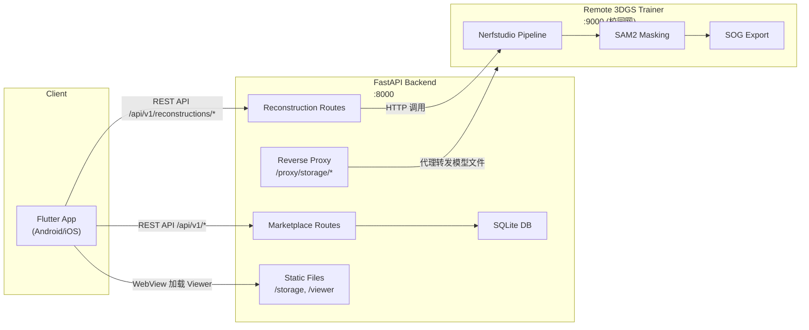
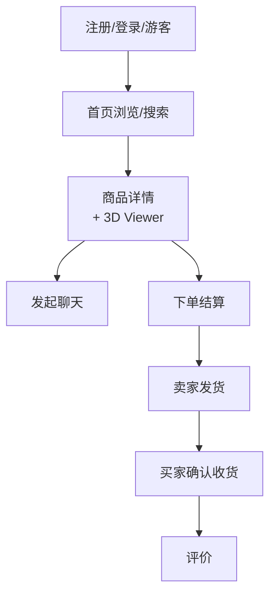
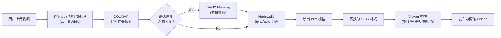

# 3dv-junk-mart 项目总览

> [!NOTE]
> 一款基于 **3D Gaussian Splatting (3DGS)** 技术的二手商品交易平台，类似"闲鱼 + 3D 商品展示"。用户可以拍摄商品视频，经过 3DGS 重建后，在商品详情页内 360° 旋转查看商品的 3D 模型。

---

## 1. 整体架构



| 层次 | 技术栈 | 关键文件/目录 |
|------|--------|-------------|
| **前端** | Flutter (Dart) | [app/lib/](file:///d:/Projects/3dv-junk-mart/app/lib/) |
| **后端** | FastAPI + SQLite | [backend/app/main.py](file:///d:/Projects/3dv-junk-mart/backend/app/main.py) |
| **3D Viewer** | PlayCanvas Engine (JS) | [viewer/viewer.js](file:///d:/Projects/3dv-junk-mart/viewer/viewer.js) |
| **训练流水线** | Nerfstudio + COLMAP + SAM2 | [trainer/pipeline.py](file:///d:/Projects/3dv-junk-mart/trainer/pipeline.py) |
| **共享配置** | Python 模块 | [shared/](file:///d:/Projects/3dv-junk-mart/shared/) |
| **部署** | systemd + nginx + logrotate | [deploy/](file:///d:/Projects/3dv-junk-mart/deploy/) |

---

## 2. 核心功能模块

### 2.1 电商交易主链路



Flutter 端按功能模块组织：

| 模块 | 目录 | 职责 |
|------|------|------|
| Auth | `features/auth/` | 登录、注册、游客模式 |
| Home | `features/home/` | 首页 Feed、Banner、分类 |
| Search | `features/search/` | 搜索、筛选 |
| Listings | `features/listings/` | 商品卡片、商品详情页 |
| Viewer | `features/viewer/` | WebView 嵌入 3D Viewer |
| Chat | `features/chat/` | 买卖双方即时消息 |
| Commerce | `features/commerce/` | 结算、订单、评价、钱包、会员 |
| Sell | `features/sell/` | 发布商品 |
| Profile | `features/profile/` | 个人中心、设置 |
| Reconstructions | `features/reconstructions/` | 3DGS 任务库、发布流程 |
| Shell | `features/shell/` | 底部导航 App Shell |

### 2.2 3DGS 重建流水线



关键配置：
- **质量档位**：`fast` / `balanced` / `quality` / `raw`，控制视频缩放和训练分辨率
- **训练步数**：7000（默认）或 30000
- **SOG 导出**：将 PLY 转换为更小的 SOG 格式供 Web Viewer 加载

### 2.3 3D Viewer (PlayCanvas)

- 基于 **PlayCanvas Engine** 的 GSplat 渲染器
- 支持 `.ply` 和 `.sog` 模型格式
- **OrbitControls**：单指旋转、双指缩放/平移/扭转
- **校准模式**：旋转 Gizmo、平移 Gizmo、网格参考面
- **初始视角设置**：设定商品展示的默认相机角度
- **自动旋转动画**：360° 展示商品
- **模型缓存**：IndexedDB 缓存避免重复下载
- 嵌入 Flutter 端通过 WebView 加载

---

## 3. 后端架构

### 3.1 路由

| 路由文件 | 前缀 | 职责 |
|---------|------|------|
| [marketplace.py](file:///d:/Projects/3dv-junk-mart/backend/app/routes/marketplace.py) (~163KB) | `/api/v1/` | 完整电商 API：认证、用户、商品、聊天、订单、评价、钱包、会员、通知等 |
| [reconstructions.py](file:///d:/Projects/3dv-junk-mart/backend/app/routes/reconstructions.py) (~49KB) | `/api/v1/reconstructions/` | 3DGS 重建任务 CRUD、训练启动、Viewer 校准、发布 |

### 3.2 服务层

| 文件 | 职责 |
|------|------|
| [marketplace_store.py](file:///d:/Projects/3dv-junk-mart/backend/app/services/marketplace_store.py) (~70KB) | SQLite 数据存储，涵盖所有电商实体的 CRUD |
| [trainer_service_client.py](file:///d:/Projects/3dv-junk-mart/backend/app/services/trainer_service_client.py) (~8KB) | 远程训练服务 HTTP 客户端 |

### 3.3 数据存储

- **业务数据**：SQLite（路径 `storage/db/business.db`）
- **任务元数据**：JSON 文件（`storage/tasks/*.json`）
- **模型文件**：`storage/models/<task_id>/model.ply` / `model.sog`
- **上传文件**：`storage/uploads/<task_id>/`
- **中间产物**：`storage/processed/<task_id>/`

### 3.4 反向代理

后端在 `/proxy/storage/*` 路径上实现了对远程训练服务器的反向代理，解决手机通过 USB 调试时无法直接访问校园网服务器的问题。

---

## 4. 关键设计决策

1. **SQLite 而非 PostgreSQL**：当前阶段使用 SQLite 简化部署，使用 `threading.local()` 解决多线程并发问题
2. **JSON 文件存储任务状态**：训练任务元数据通过 JSON 文件 + 文件锁管理，便于流水线进程直接读写
3. **WebView 集成 3D Viewer**：Flutter 端通过 WebView 加载 PlayCanvas 渲染的 3D 场景
4. **反向代理模型下载**：通过后端代理远程模型文件，避免移动端直连校园网
5. **服务端驱动 UI**：页面数据通过 `/pages/*` Bootstrap 端点返回，前端从数据组装 UI

---

## 5. 本地开发链路

```
Android Flutter ──(adb reverse)──> localhost:8000 ──> FastAPI Backend ──> 远程 3DGS Trainer :9000
```

- 后端：`uvicorn backend.app.main:app --host 0.0.0.0 --port 8000 --reload`
- Flutter：`flutter run --dart-define=API_BASE_URL=http://127.0.0.1:8000`
- 远程训练服务需校园网可达 (`222.199.216.192:9000`)

---

## 6. 项目文档索引

| 文档 | 内容 |
|------|------|
| [README.md](file:///d:/Projects/3dv-junk-mart/README.md) | 项目总览与运行方式 |
| [API_PROTO.md](file:///d:/Projects/3dv-junk-mart/API_PROTO.md) | API 协议规范（18个章节） |
| [DATABASE_PROTO.md](file:///d:/Projects/3dv-junk-mart/DATABASE_PROTO.md) | 数据库概念模型 |
| [LOCAL_RUN_3DV_JUNK_MART.md](file:///d:/Projects/3dv-junk-mart/LOCAL_RUN_3DV_JUNK_MART.md) | 本地联调手册 |
| [docs/1-3DGS工作流.md](file:///d:/Projects/3dv-junk-mart/docs/1-3DGS工作流.md) | 3DGS 技术工作流 |
| [docs/2-开发方案.md](file:///d:/Projects/3dv-junk-mart/docs/2-基于%203DGS%20技术的%203D%20二手商品交易平台开发方案.md) | 总体开发方案 |
| [docs/7-Viewer解决方案.md](file:///d:/Projects/3dv-junk-mart/docs/7-Viewer解决方案与优化方向.md) | Viewer 技术选型与优化 |
| [docs/14-SAM2接入报告.md](file:///d:/Projects/3dv-junk-mart/docs/14-SAM2对象Masking接入报告.md) | SAM2 对象分割接入 |
| [docs/17-环境搭建交接.md](file:///d:/Projects/3dv-junk-mart/docs/17-3DGS项目环境搭建与运行交接文档.md) | 完整环境搭建文档 |
| [docs/18-后端开发TODO.md](file:///d:/Projects/3dv-junk-mart/docs/18-后端开发TODO.md) | 后端开发任务清单 |
| [docs/19-电商收口总结.md](file:///d:/Projects/3dv-junk-mart/docs/19-电商业务收口与体验优化总结.md) | 电商业务收口总结 |
| [docs/验收清单.md](file:///d:/Projects/3dv-junk-mart/docs/验收清单.md) | 验收检查清单 |

---

## 7. 代码规模概览

| 组件 | 代码量估算 | 说明 |
|------|-----------|------|
| Flutter App | ~20+ Dart 文件 | 完整电商 UI + 3D Viewer 集成 |
| Backend Routes | ~212KB | marketplace.py 163KB + reconstructions.py 49KB |
| Backend Services | ~78KB | marketplace_store 70KB + trainer_client 8KB |
| Trainer Pipeline | ~79KB | 2151 行 Python 训练流水线 |
| 3D Viewer | ~55KB JS | 1723 行 PlayCanvas 渲染 + 交互 |
| Schemas | ~19KB | Pydantic 数据模型 |
| Tests | ~83KB | 后端矩阵测试 + 部署验证 + 远程连通性测试 |
