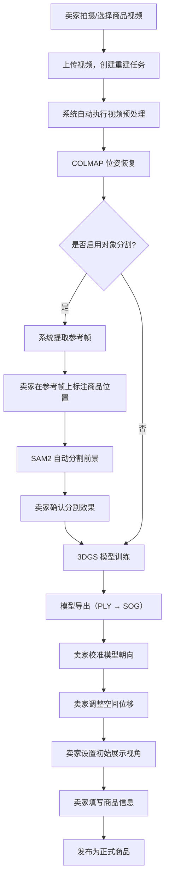
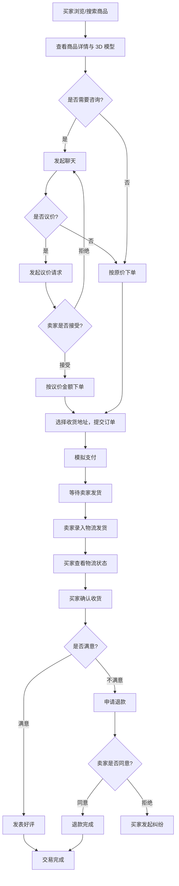
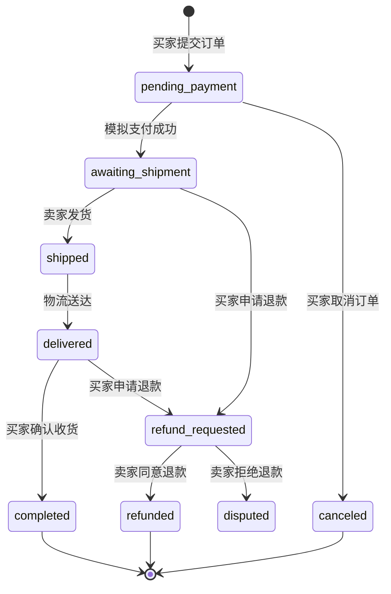

# 系统设计 — 一、需求分析

## 1. 用户角色分析

转物3D 平台涉及三类用户角色，各角色的核心诉求和操作权限不同：

**卖家（Seller）：** 拥有闲置物品并希望通过平台出售的个人用户。卖家的核心诉求是以最直观的方式展示商品外观，提高买家信任度和成交率。卖家在平台上的主要操作包括：拍摄并上传商品视频、管理三维重建任务、校准 3D 模型展示效果、填写商品信息并发布上架、处理买家咨询与议价、执行发货和售后操作。

**买家（Buyer）：** 有二手商品购买需求的消费者。买家的核心诉求是在下单前尽可能全面地了解商品真实状况，降低"货不对板"的风险。买家在平台上的主要操作包括：浏览和搜索商品、通过 3D 模型 360° 查看商品、与卖家即时沟通、下单支付、查看物流并确认收货、发表交易评价。

**游客（Guest）：** 未注册或未登录的访客用户。游客可以浏览首页推荐、搜索商品、查看商品详情和 3D 预览，但不能执行下单、聊天、发布商品等交易操作。当游客尝试访问需要登录的功能时，系统引导其进入登录或注册流程。

## 2. 功能性需求

根据用户角色和业务场景分析，系统的功能性需求划分为以下四大模块：

### 2.1 用户体系模块

| 需求编号 | 功能需求 | 说明 |
|---------|---------|------|
| F-01 | 用户注册 | 用户提供昵称、账号标识和密码完成注册，注册成功后自动登录并进入主页 |
| F-02 | 用户登录 | 用户输入账号标识和密码进行身份验证，登录成功后恢复会话状态 |
| F-03 | 游客模式 | 未登录用户可以游客身份浏览平台内容，触发交易操作时提示登录 |
| F-04 | 退出登录 | 用户主动退出当前会话，客户端清除本地凭证并返回登录页 |
| F-05 | 个人资料管理 | 用户可编辑头像、昵称、出生日期、个人简介、所在地区、资料可见性等个人信息 |
| F-06 | 收货地址管理 | 用户可新增、编辑、删除收货地址，并设置默认地址；下单时自动选中默认地址 |

### 2.2 三维重建模块

| 需求编号 | 功能需求 | 说明 |
|---------|---------|------|
| F-07 | 视频上传与任务创建 | 卖家选择或拍摄商品环绕视频（≤60秒），上传后系统自动创建三维重建任务 |
| F-08 | 自动三维重建 | 系统自动执行视频预处理、相机位姿恢复、3DGS 模型训练和导出，全程无需用户干预 |
| F-09 | 任务状态跟踪 | 卖家可实时查看重建任务的当前状态、进度百分比、训练步数和预计剩余时间 |
| F-10 | 对象分割（可选） | 卖家可选择启用智能前景分割功能，在参考帧上标注商品位置，系统自动分离商品与背景 |
| F-11 | 模型校准 | 卖家通过可视化工具调整模型的旋转朝向、空间位移和初始展示视角 |
| F-12 | 3D 商品展示 | 买家在商品详情页中通过嵌入式 3D 查看器 360° 旋转、缩放和平移查看商品模型 |
| F-13 | 任务库管理 | 卖家可查看所有重建任务的列表，包括各任务的状态、创建时间和关联商品信息 |
| F-14 | 质量档位选择 | 卖家可在创建任务时选择不同的质量档位，在重建速度和模型精度之间进行权衡 |

### 2.3 商品与交易模块

| 需求编号 | 功能需求 | 说明 |
|---------|---------|------|
| F-15 | 商品发布 | 卖家填写商品标题、描述、价格、成色等信息，关联 3D 模型后发布上架 |
| F-16 | 首页浏览 | 首页展示推荐 Banner、商品分类入口、3D 专区和推荐商品列表，支持下拉刷新 |
| F-17 | 商品搜索与筛选 | 支持关键词搜索、热门搜索推荐、多维度筛选（价格、成色、是否有 3D 模型）和排序 |
| F-18 | 商品详情 | 展示商品完整信息、3D 预览入口、卖家信息、服务承诺、相似商品推荐和买家评价 |
| F-19 | 即时聊天 | 买卖双方可针对商品创建会话并发送文字消息，支持快捷话术和消息已读状态同步 |
| F-20 | 议价功能 | 买家可在聊天中向卖家发起议价请求，卖家可接受或拒绝，接受后买家可按议价金额下单 |
| F-21 | 商品收藏 | 买家可收藏感兴趣的商品，并在"我的收藏"页面统一管理 |
| F-22 | 下单与结算 | 买家选择收货地址并确认订单信息后提交订单，进入模拟支付流程 |
| F-23 | 订单管理 | 买卖双方可查看订单列表和详情，订单按状态分类展示（待支付/待发货/待收货/已完成/售后） |
| F-24 | 物流与发货 | 卖家录入物流单号完成发货操作，买家可查看物流状态和时间轴 |
| F-25 | 确认收货 | 买家确认收货后订单完成，触发钱包结算和商品状态更新 |
| F-26 | 退款与纠纷 | 买家可申请退款，卖家可同意或拒绝；拒绝退款后买家可发起纠纷 |
| F-27 | 交易评价 | 买家在订单完成后可对交易进行星级评分、选择评价标签并撰写文字评价 |
| F-28 | 卖家商品管理 | 卖家可查看、编辑和删除自己发布的商品，支持更新商品封面图片 |

### 2.4 账户服务模块

| 需求编号 | 功能需求 | 说明 |
|---------|---------|------|
| F-29 | 钱包 | 用户可查看钱包可用余额和冻结余额，浏览购买、退款、结算等交易流水记录 |
| F-30 | 会员体系 | 用户可查看会员方案列表和当前会员等级，支持升级会员 |
| F-31 | 通知中心 | 系统在订单状态变更、收到消息、退款处理等关键事件时推送应用内通知，支持单条已读和全部已读 |
| F-32 | 个人主页 | 展示用户头像、统计数据（发布/售出/购买/收藏数量）、我的商品、服务入口等信息 |

## 3. 非功能性需求

| 类别 | 需求描述 |
|------|---------|
| **性能** | 3D 模型在移动端 WebView 中应能流畅加载和交互，首次加载后通过本地缓存避免重复下载；API 接口响应时间应控制在合理范围内 |
| **安全性** | 用户密码需加密存储；写操作接口需进行身份验证和权限校验；重建任务的操作需验证任务归属关系，防止越权访问 |
| **可用性** | 即使远程训练服务不可用，平台的浏览、搜索、聊天、交易等核心电商功能仍应正常运作；系统应对空数据、网络异常等边界情况提供友好的提示 |
| **兼容性** | 移动端 App 应适配不同屏幕尺寸的 Android 设备，特别是窄屏设备上的键盘弹起、布局溢出等场景；3D 查看器应兼容主流移动浏览器内核 |
| **可维护性** | 前后端通过规范化的 API 协议解耦；训练环境与业务后端环境隔离；任务状态变更通过统一的状态机管理，便于排查和回溯 |

## 4. 用例图

以下用例图展示了三类用户角色与系统核心功能之间的关系：

```mermaid
graph LR
    Guest["🧑 游客"]
    Buyer["🛒 买家"]
    Seller["📦 卖家"]

    subgraph 用户体系
        UC01["注册"]
        UC02["登录"]
    end

    subgraph 商品浏览
        UC03["浏览首页"]
        UC04["搜索与筛选"]
        UC05["查看商品详情"]
        UC06["3D 模型查看"]
    end

    subgraph 交易流程
        UC07["即时聊天与议价"]
        UC08["收藏商品"]
        UC09["下单与支付"]
        UC10["确认收货"]
        UC11["申请退款/纠纷"]
        UC12["发表评价"]
    end

    subgraph 三维重建
        UC13["上传视频创建任务"]
        UC14["查看任务状态"]
        UC15["对象分割标注"]
        UC16["模型校准"]
        UC17["发布为商品"]
    end

    subgraph 卖家履约
        UC18["商品管理"]
        UC19["录入物流发货"]
        UC20["处理退款"]
    end

    subgraph 账户服务
        UC21["个人资料管理"]
        UC22["地址管理"]
        UC23["钱包"]
        UC24["通知中心"]
        UC25["会员"]
    end

    Guest --- UC01
    Guest --- UC02
    Guest --- UC03
    Guest --- UC04
    Guest --- UC05
    Guest --- UC06

    Buyer --- UC03
    Buyer --- UC04
    Buyer --- UC05
    Buyer --- UC06
    Buyer --- UC07
    Buyer --- UC08
    Buyer --- UC09
    Buyer --- UC10
    Buyer --- UC11
    Buyer --- UC12
    Buyer --- UC21
    Buyer --- UC22
    Buyer --- UC23
    Buyer --- UC24
    Buyer --- UC25

    Seller --- UC03
    Seller --- UC05
    Seller --- UC06
    Seller --- UC07
    Seller --- UC13
    Seller --- UC14
    Seller --- UC15
    Seller --- UC16
    Seller --- UC17
    Seller --- UC18
    Seller --- UC19
    Seller --- UC20
    Seller --- UC21
    Seller --- UC22
    Seller --- UC23
    Seller --- UC24
    Seller --- UC25
```

## 5. 核心业务流程

### 5.1 三维重建与商品发布流程

该流程描述了卖家从拍摄商品视频到最终发布 3D 商品的完整操作路径：

### 5.2 交易主链路流程

该流程描述了从买家发现商品到完成交易的完整购物路径：

### 5.3 订单状态流转

订单在其生命周期内经历以下状态变迁：

