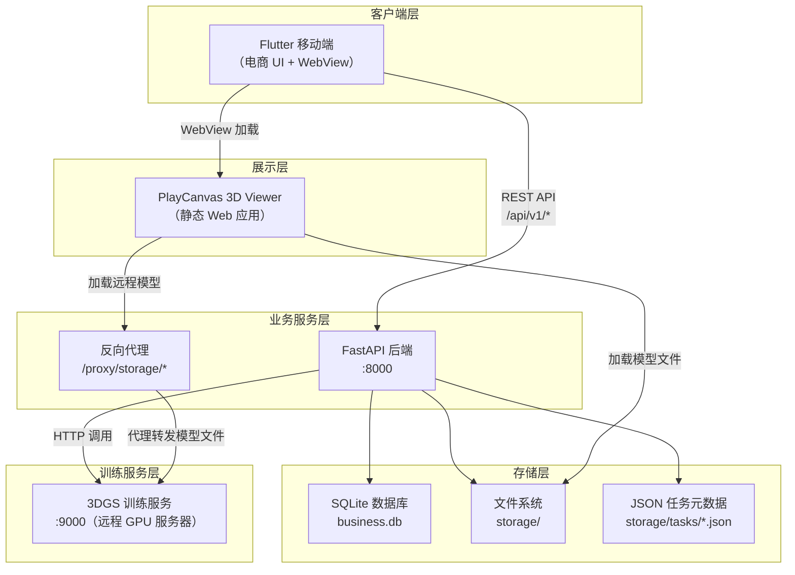
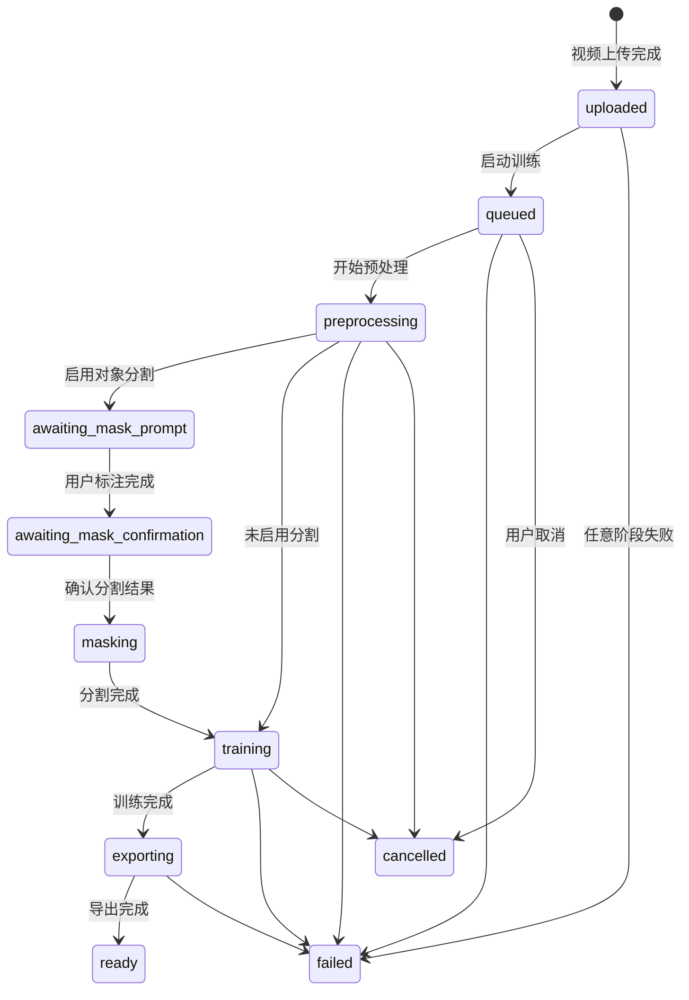
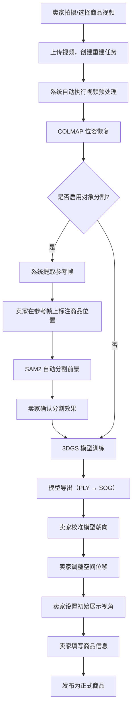
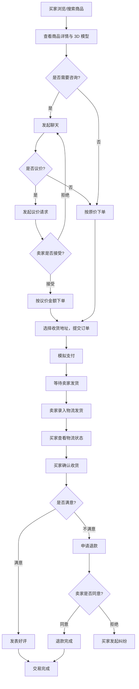
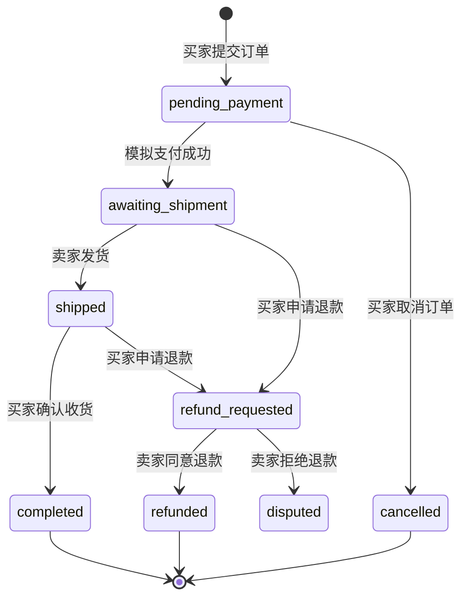

# 系统设计 — 二、系统设计

## 1. 总体架构设计

转物3D 采用前后端分离的分层架构，系统整体由四个核心组件构成：Flutter 移动端、FastAPI 业务后端、PlayCanvas 3D 查看器和 3DGS 训练流水线。各组件通过 HTTP 协议通信，职责边界清晰，可独立开发和部署。



各层职责说明：

| 层次 | 组件 | 核心职责 |
|------|------|---------|
| **客户端层** | Flutter App | 提供电商交互界面，处理用户输入，通过 REST API 与后端通信；通过 WebView 嵌入 3D Viewer |
| **业务服务层** | FastAPI 后端 | 处理全部业务逻辑（认证、商品、订单、聊天等），管理三维重建任务，提供静态文件服务，代理远程训练服务器资源 |
| **存储层** | SQLite + 文件系统 + JSON | 业务数据持久化（SQLite）、二进制资源存储（文件系统）、训练任务状态管理（JSON 文件） |
| **训练服务层** | 3DGS Trainer | 部署于远程 GPU 服务器，执行视频预处理、COLMAP 位姿恢复、Splatfacto 训练、模型导出等计算密集型任务 |
| **展示层** | PlayCanvas Viewer | 独立的 Web 前端应用，基于 PlayCanvas 引擎渲染 3DGS 模型，提供旋转、缩放、校准等交互功能 |

## 2. 数据存储设计

### 2.1 业务数据库

业务数据采用 SQLite 存储，数据库使用单表多类型（Single Table Inheritance）的设计模式。系统定义了一张通用的 `records` 表，所有业务实体（用户、商品、订单、聊天等）统一存储在该表中，通过 `entity_type` 字段区分实体类型：

```
records 表结构
├── entity_type   TEXT    -- 实体类型（如 user, listing, order）
├── entity_id     TEXT    -- 实体唯一标识
├── parent_id     TEXT    -- 父实体标识（用于表达从属关系）
├── payload_json  TEXT    -- JSON 格式的业务数据载荷
├── created_at    TEXT    -- 创建时间（UTC ISO 格式）
└── updated_at    TEXT    -- 更新时间（UTC ISO 格式）
主键：(entity_type, entity_id)
```

该设计的核心思路是：将关系型约束收敛为"类型 + ID"二元主键，将业务字段全部存储在 `payload_json` 字段中。这样做的优势在于：新增业务实体时无需修改数据库表结构，开发迭代速度快，适合原型阶段的快速演进。

系统当前定义了以下业务实体类型：

| 分组 | 实体类型 | 说明 |
|------|---------|------|
| **用户** | `user`、`user_profile`、`user_consent`、`user_address`、`user_follow`、`user_stat` | 用户账户、资料、授权同意、收货地址、关注关系、统计数据 |
| **认证** | `auth_session`、`login_attempt` | 登录会话、登录尝试记录 |
| **商品** | `listing`、`listing_draft`、`listing_media`、`listing_spec`、`listing_favorite`、`category` | 商品、商品草稿、商品媒体、商品规格、收藏、分类 |
| **交易** | `order`、`order_item`、`order_event`、`shipment`、`shipment_event` | 订单、订单商品、订单事件、物流、物流事件 |
| **聊天** | `conversation`、`conversation_member`、`conversation_offer`、`message` | 会话、会话成员、议价请求、消息 |
| **评价** | `review`、`review_media`、`review_tag`、`review_tag_link` | 评价、评价媒体、评价标签、标签关联 |
| **账户服务** | `wallet_account`、`wallet_transaction`、`membership_plan`、`membership_subscription`、`notification` | 钱包、交易流水、会员方案、会员订阅、通知 |
| **平台配置** | `banner`、`home_section`、`service_card`、`feature_flag`、`app_config`、`search_suggestion` | 首页Banner、页面分区、服务入口、功能开关、搜索建议 |

实体之间的关联通过 `parent_id` 字段和 `payload_json` 中的引用 ID 建立。例如，商品媒体（`listing_media`）的 `parent_id` 指向所属商品的 `entity_id`，订单（`order`）的 `payload_json` 中包含 `buyer_id`、`seller_id`、`listing_id` 等关联字段。

数据库连接管理采用线程本地存储（`threading.local()`），每个线程持有独立的 SQLite 连接实例，并配置了 WAL 日志模式和 3 秒忙等待超时，保障多线程并发下的数据安全。

### 2.2 训练任务元数据

三维重建任务的状态元数据以独立 JSON 文件形式存储于 `storage/tasks/` 目录，每个任务对应一个 `{task_id}.json` 文件。任务状态通过文件锁（Windows 使用 `msvcrt`，Linux 使用 `fcntl`）实现原子化读写，确保训练流水线进程与后端服务之间的并发安全。

任务状态机定义了以下状态：



### 2.3 文件系统布局

系统的二进制资源按任务维度组织在本地文件系统中：

```
storage/
├── db/
│   └── business.db           # SQLite 业务数据库
├── tasks/
│   └── {task_id}.json         # 训练任务元数据
├── uploads/
│   └── {task_id}/
│       └── source.mp4         # 用户上传的原始视频
├── processed/
│   └── {task_id}/
│       ├── dataset/           # COLMAP 处理后的数据集
│       ├── mask_preview_frames/  # 对象分割预览帧
│       └── mask_prompts.json  # 用户标注的分割提示点
├── models/
│   └── {task_id}/
│       ├── model.ply          # PLY 格式高斯模型
│       ├── model.sog          # SOG 压缩格式模型
│       └── viewer.json        # Viewer 校准参数
├── listing_covers/            # 商品封面图片
└── seed/                      # 平台初始化占位资源
```

## 3. API 接口设计

### 3.1 统一响应格式

所有 API 接口遵循统一的 JSON 响应信封（Envelope）格式：

```json
{
  "code": 0,
  "message": "ok",
  "data": { ... },
  "meta": {
    "request_id": "...",
    "page": { "page": 1, "page_size": 20, "total": 100 }
  },
  "errors": []
}
```

其中 `code` 为业务状态码（0 表示成功），`data` 为业务数据载荷，`meta` 包含请求元信息和分页信息，`errors` 在校验失败时携带字段级错误详情。

### 3.2 认证机制

系统采用 Bearer Token 认证方式。用户登录或注册成功后，服务端返回 `access_token`，客户端在后续请求的 `Authorization` 头中携带该令牌。写操作接口（下单、发消息、发布商品等）强制要求认证，只读接口（浏览商品、搜索）支持未认证访问。未登录用户通过 Guest Session 机制获取受限的只读会话。

### 3.3 接口模块划分

后端 API 划分为两组路由模块：

**电商业务路由（`/api/v1/`）：**

| 功能域 | 主要端点 | 说明 |
|--------|---------|------|
| 认证 | `POST /auth/register`、`POST /auth/login`、`GET /auth/session` | 注册、登录、获取会话（含游客回退） |
| 用户 | `GET /users/me/profile`、`PATCH /users/me/profile` | 个人资料查看与编辑 |
| 地址 | `GET /users/me/addresses`、`POST /users/me/addresses` | 收货地址 CRUD |
| 商品 | `GET /listings`、`GET /listings/{id}`、`POST /listings/{id}/favorite` | 商品列表、详情、收藏 |
| 搜索 | `GET /search/listings`、`GET /search/suggestions` | 搜索与建议 |
| 聊天 | `POST /conversations`、`POST /conversations/{id}/messages` | 创建会话、发送消息 |
| 议价 | `POST /conversations/{id}/offers`、`POST /conversations/{id}/offers/{id}/accept` | 发起与接受议价 |
| 订单 | `POST /orders`、`POST /orders/{id}/ship`、`POST /orders/{id}/confirm` | 下单、发货、确认收货 |
| 评价 | `POST /reviews`、`GET /reviews/draft/{order_id}` | 提交评价、评价草稿 |
| 钱包 | `GET /wallet`、`GET /wallet/transactions` | 余额与流水查询 |
| 会员 | `GET /membership/plans`、`POST /membership/upgrade` | 方案查看与升级 |
| 通知 | `GET /notifications`、`POST /notifications/{id}/read` | 通知列表与已读标记 |
| 页面 | `GET /pages/{page_key}`  | 服务端驱动的页面数据组装 |

**三维重建路由（`/api/v1/reconstructions/`）：**

| 功能域 | 主要端点 | 说明 |
|--------|---------|------|
| 任务管理 | `POST /`、`GET /{task_id}`、`GET /` | 创建任务（含视频上传）、查询任务、任务列表 |
| 训练控制 | `POST /{task_id}/start`、`POST /{task_id}/cancel` | 启动和取消训练流水线 |
| 对象分割 | `POST /{task_id}/mask-prompt`、`POST /{task_id}/mask-confirm` | 标注分割提示点、确认分割结果 |
| 模型校准 | `GET /{task_id}/viewer-config`、`PUT /{task_id}/viewer-config` | 读取和保存 Viewer 校准参数 |
| 商品发布 | `POST /{task_id}/publish` | 将完成的 3D 模型发布为正式商品 |

### 3.4 反向代理

后端在 `/proxy/storage/{path}` 路径实现了反向代理，将请求转发至远程训练服务器（`GS_SERVICE_BASE_URL`）的对应存储路径。该设计解决了移动端通过 USB 调试连接本地后端时，无法直接访问校园网内部训练服务器的问题。代理响应中注入 CORS 头，确保 WebView 中的跨域模型加载请求正常工作。

## 4. 前端架构设计

Flutter 移动端采用**特性模块化**（Feature-based Architecture）的代码组织方式，按业务功能划分为独立的功能模块：

```
app/lib/
├── app/
│   └── app.dart               # 应用入口，管理认证状态与路由切换
├── core/
│   ├── api/
│   │   └── api_client.dart    # 统一 HTTP 客户端封装
│   └── session/
│       ├── app_session.dart   # 会话数据模型
│       └── session_store.dart # 本地会话持久化
├── theme/
│   └── app_theme.dart         # Material 主题配置
└── features/
    ├── auth/                  # 登录、注册
    ├── home/                  # 首页
    ├── search/                # 搜索与筛选
    ├── listings/              # 商品卡片与商品详情
    ├── viewer/                # 3D Viewer WebView 页面
    ├── chat/                  # 即时聊天
    ├── commerce/              # 结算、订单、评价、钱包、会员
    ├── sell/                  # 商品发布
    ├── profile/               # 个人中心
    ├── reconstructions/       # 三维重建任务管理
    └── shell/                 # 底部导航 App Shell
```

各功能模块通过统一的 `ApiClient` 层与后端通信。`ApiClient` 封装了 HTTP 请求的构造、Bearer Token 注入、响应信封解析和错误处理逻辑，所有模块共享同一个客户端实例。

3D Viewer 的集成采用 WebView 嵌入方式：Flutter 端使用 `webview_flutter` 组件加载后端挂载的 Viewer 静态页面，将模型地址和校准参数通过 URL 查询参数传递给 Viewer。这种设计使得 3D 渲染逻辑与原生 App 代码完全解耦，Viewer 可独立迭代而无需重新构建 App。

## 5. 核心业务流程

### 5.1 三维重建与商品发布流程

该流程描述了卖家从拍摄商品视频到最终发布 3D 商品的完整操作路径：



### 5.2 交易主链路流程

该流程描述了从买家发现商品到完成交易的完整购物路径：



### 5.3 订单状态流转

订单在其生命周期内经历以下状态变迁：



## 6. 关键设计决策

| 决策 | 方案 | 理由 |
|------|------|------|
| **业务数据库选型** | SQLite 单表多类型 | 零配置部署，原型阶段快速迭代；单表设计避免频繁的 Schema 迁移，新增实体类型只需定义新的 `entity_type` 值 |
| **训练任务状态存储** | JSON 文件 + 文件锁 | 训练流水线作为独立进程运行，无法共享 SQLite 连接；JSON 文件可被训练进程和后端服务同时安全读写 |
| **3D Viewer 集成** | WebView 嵌入独立 Web 应用 | 3D 渲染逻辑与 App 代码解耦；Viewer 可独立迭代；避免在 Flutter 层引入复杂的 3D 渲染依赖 |
| **远程模型访问** | 后端反向代理 | 移动端通过 USB 调试时无法直接访问校园网训练服务器；通过后端代理透传请求，对客户端透明 |
| **页面数据组装** | 服务端驱动 UI（`/pages/*` Bootstrap） | 首页、个人中心等页面数据由后端组装后整体返回，减少客户端请求次数，降低前端逻辑复杂度 |
| **训练与业务后端隔离** | 独立进程 + 独立 Python 环境 | 训练任务计算密集且耗时长，不应阻塞 API 服务；训练依赖（PyTorch/CUDA）与业务后端依赖（FastAPI）版本不兼容，需要独立环境 |
