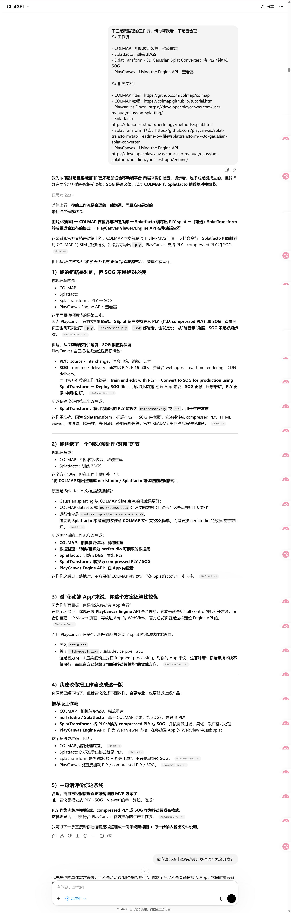
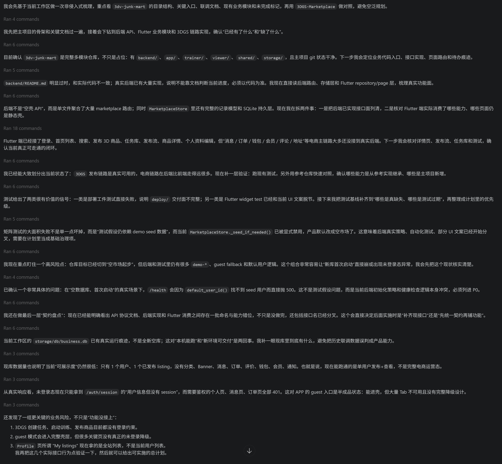
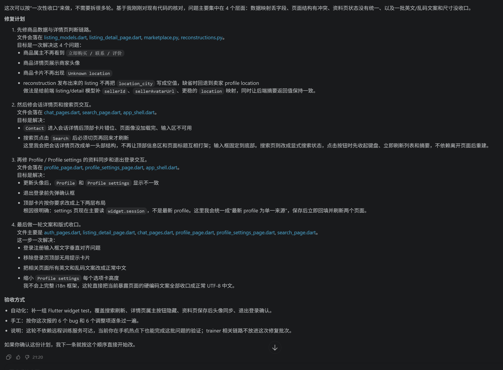
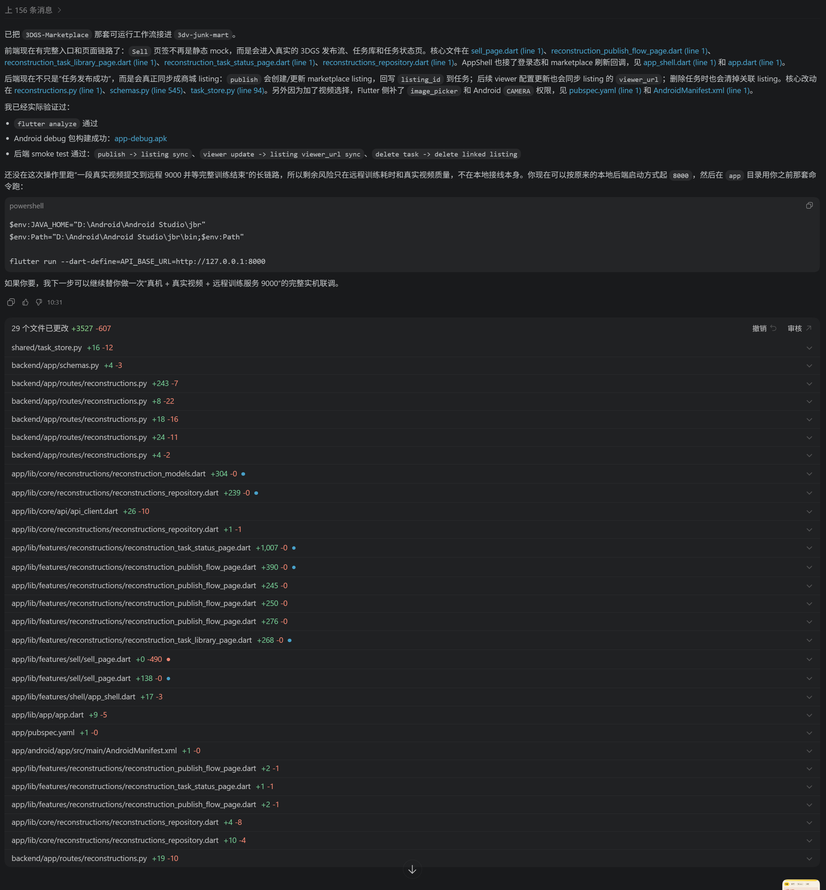
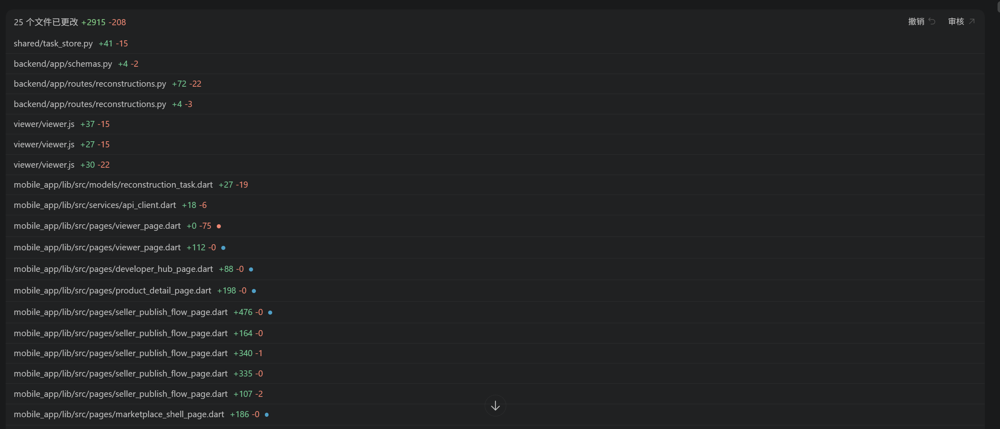
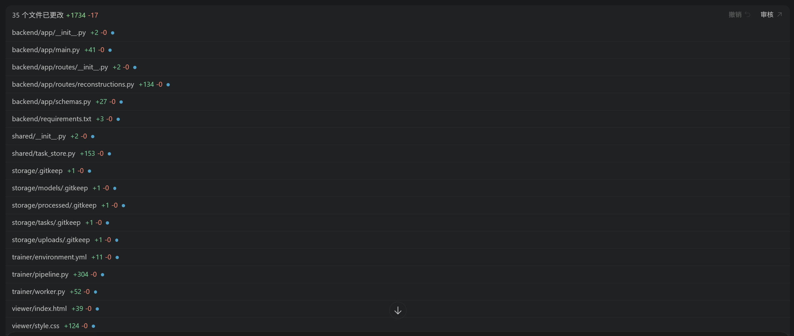

# AI工具使用情况（典型）

- Gemini：操作指导
- ChatGPT：方案设计，可行性分析
- Codex/Antigravity：代码实现、项目部署、问题修复

## 方案设计阶段

> 开发前，使用 ChatGPT 进行方案设计、可行性分析、搜集工具和资料等



## 开发阶段

### 案例1

> 使用 Codex 的 Plan 模式，将先后开发的两个项目进行整合，

提示词：

```
当前工作区有两个项目：`3DGS-Marketplace` 是我最早已经跑通的参考实现，`3dv-junk-mart` 是当前继续开发的主项目。这个项目是一个基于 3DGS 的二手商品交易平台，后端和 Flutter 本地联调链路已经打通，远程 3DGS 训练服务运行在 `http://222.199.216.192:9000`。目前 `3dv-junk-mart` 已经接入了 3DGS 基本工作流，并且我又对 APP 做过一轮整理，删除了大量显式静态模型和开发者日志，尽量向可交付用户的状态收敛。

现在，请你在当前项目的基础上，实现完整的电商业务。请你基于当前 `3dv-junk-mart` 项目的实际代码和现状，先全面梳理项目结构、现有能力、未完成部分和主要风险，然后制定一份系统、详细、可执行的任务计划，目标是把它推进到可直接面向用户展示的高完整度电商产品状态。先不要空谈方案，先读代码、看清当前进度，再给出高质量计划，并在后续聊天中按计划逐步实施。
```

分析过程：


计划：

```markdown
# 3dv-junk-mart 电商化落地计划

## Summary
- 当前仓库已经形成 `Flutter app + FastAPI 业务后端 + 远程 3DGS 训练服务 + 本地 viewer` 的完整骨架，真正可用的闭环是“登录/游客进入 -> 发布 3D 任务 -> 远程训练 -> Viewer 校准 -> 发布 listing -> 首页/详情查看 3D 商品”。
- 主项目相较 `3DGS-Marketplace` 的新增重点在于：本地业务后端、SQLite 业务存储、基础电商资源模型、个人资料编辑、与远程训练服务的联通；参考仓库主要提供 3DGS 发布链路，不包含完整电商成品。
- 当前最关键的真实现状是：后端电商 API 面已经铺开，但前端只接通了首页/搜索/详情/发布流/个人资料，消息、下单、订单、评价、钱包、会员、通知仍未形成真实前台闭环。
- 当前最关键的真实风险是：`/health` 依赖默认用户导致空库首次启动会 500；3DGS 任务创建/启动/发布未强制登录；guest 模式能进壳但没有完整只读降级；训练服务 URL 依赖运行时环境，当前默认 `127.0.0.1:9000`，与实际远程服务配置容易漂移。
- 当前维护性风险也很高：`backend/app/routes/marketplace.py`、`backend/app/services/marketplace_store.py`、`app/lib/features/reconstructions/reconstruction_publish_flow_page.dart` 都已超过千行，后续实现应优先在现架构上补齐功能，不做大规模重构拖慢交付。

## Current State
- 已有能力：登录/注册、游客进入、个人资料编辑与头像上传、商品列表/详情、3DGS 任务库、训练启动/取消/Mask/Viewer 校准/发布、Viewer 代理访问、SQLite 持久化、远程 trainer 客户端。
- 后端已存在但前端未接通的能力：地址 CRUD、收藏、会话详情/发消息/已读、订单查询/取消/确认收货、评价草稿/提交、钱包、会员、通知、页面 bootstrap。
- 明确未完成：创建订单、卖家发货、创建会话、聊天列表/详情前台、订单详情/支付成功页、评价页、通知页、钱包页、会员页、搜索 facets 的真实接入、guest 只读约束、任务按用户隔离。
- 当前真实数据状态只支持“纯空市场 + 少量个人实跑数据”，没有分类/Banner/服务卡/会员方案/评价标签等平台元数据；这不冲突于“纯空市场”目标，但需要补齐平台配置种子。
- 当前自动化基线失真：部署测试缺少 `deploy` 工件直接失败；后端矩阵测试仍假设 demo seed 用户/商品/订单存在；Flutter widget test 仍绑定旧英文文案和旧页面结构。

## Public API And Behavior Changes
- 保持 `/api/v1` 不变，现有 Flutter 已消费的接口继续可用；采用“补充缺失接口 + 增加别名 + 修正行为”而不是破坏式改名。
- 新增或补齐接口：`POST /conversations`、`GET /conversations/{conversation_id}/messages`、`GET /pages/conversations/{conversation_id}`、`POST /orders`、`POST /orders/{order_id}/ship`、`GET /orders/{order_id}/receipt`、`POST /orders/{order_id}/dispute`、`GET /pages/orders/{order_id}/success`、`GET /pages/reviews/{order_id}`、`GET /reviews/tags`、`GET/PATCH /orders/{order_id}/review-draft`、`GET /listings/{listing_id}/reviews`、`GET /home/feed`。
- 新增兼容别名：`GET /wallet/summary -> /wallet`，`GET /memberships/current -> /membership/subscription`，`POST /notifications/read-all -> /notifications/read`。
- `GET /auth/session` 改为返回“合成 guest session”，不再回退到第一个真实用户；guest session 保留空 access token，并显式携带 `guest_mode: true`。
- 所有写接口强制登录：包括 reconstruction 创建/启动/取消/Mask/发布/Viewer 校准、收藏、创建会话、发消息、下单、地址写入、评价提交、会员升级、通知已读。
- reconstruction 任务必须绑定创建者 `seller_id`，列表与详情默认只返回当前用户自己的任务；发布 listing 时只能以任务归属用户为卖家。
- `POST /auth/logout` 必须兼容“仅 Bearer header、无 body”的当前 Flutter 调用方式。
- `/health`、`/api/v1/health`、`/api/v1/config/public`、`/api/v1/pages/home` 必须在空数据库下稳定返回，不依赖 demo 用户。
- 订单状态流统一为：`live listing -> POST /orders 创建 paid order 并将 listing 置为 reserved -> 卖家 ship -> 买家 confirm-receipt -> order completed + listing sold -> 才允许 review`；取消订单仅允许未发货阶段，取消后 listing 回到 `live`。
- 本期支付与物流为展示级闭环：支付方法使用平台内模拟支付，物流由卖家录入 `carrier_name/tracking_no`，不接第三方支付/短信/实名。
- 平台默认“纯空市场”：不内置 demo 用户、demo 商品、demo 订单、demo 聊天；但允许内置平台元数据，例如分类、服务卡、会员方案、评价标签、空态 Banner。

## Implementation Plan
- **P0 稳定底座**
- 修复空库启动：去掉 `default_user_id()` 对健康检查和 guest 会话的硬依赖；平台元数据初始化与用户数据初始化彻底分离。
- 修复安全边界：给全部 reconstruction 写接口补鉴权和归属校验，阻断游客/匿名用户消耗远程训练资源和发布商品。
- 修复运行时配置：统一使用 `GS_SERVICE_BASE_URL` 和 `GS_SERVICE_PUBLIC_BASE_URL`；所有 task/listing 的 `model_url/viewer_url/video_url` 在返回前都重写成手机可访问的代理或公共地址。
- 补齐部署工件：补 `deploy/linux/systemd/*.service`、`deploy/scripts/backup_runtime_state.py`、`deploy/scripts/check_runtime_health.py`、环境样例和启动文档。

- **P1 后端契约补齐**
- 在现有 `MarketplaceStore` 泛型 records 架构上继续实现，不做表级重构；只增加缺失 record type helper 和更清晰的 domain helper。
- 补齐平台元数据初始化：分类、服务卡、会员计划、评价标签、首页 Banner/空态资源；这些是平台配置，不算 demo 市场数据。
- 补齐页面 bootstrap：`pages/home`、`pages/me`、`pages/messages`、`pages/orders/{id}`、`pages/orders/{id}/success`、`pages/reviews/{order_id}`、`pages/conversations/{id}` 全部空态安全。
- 对齐 `API_PROTO.md`：优先补接口缺口和命名别名，不再新增第二套不兼容命名。
- 规范错误与分页：所有新增接口继续走 `ApiEnvelope`，保持 `meta.page` 一致。

- **P2 电商主链路后端**
- 聊天：实现“从 listing 发起或获取会话”、消息历史获取、消息发送、已读同步、会话列表未读数更新、下单/发货/评价后的通知写入。
- 下单：实现 `POST /orders`，输入 `listing_id + address_id`，写入 order 快照、order_event、payment mock、buyer/seller notification，并将 listing 状态改为 `reserved`。
- 发货与收货：实现卖家发货接口、买家确认收货、买家取消、争议入口；订单事件和 shipment 事件必须追加写入。
- 评价：实现评价标签、按订单的 review draft、评价提交校验、listing 评价列表；只允许 completed order 评价。
- 钱包/会员/通知：钱包以展示级账本为准，记录下单、退款、会员升级的流水；会员升级不接真实支付，只写 subscription 和 wallet transaction；通知支持单条与全部已读。
- 地址：沿用已有 CRUD，并接入 checkout 默认地址与订单快照。

- **P3 Flutter 前台补齐**
- 新建真实的 `messages`、`conversation_detail`、`checkout`、`order_detail`、`order_success`、`review`、`wallet`、`membership`、`notifications` 页面；现有 `features/flows/product_flow_pages.dart` 仅作为视觉参考，不再直接作为业务实现入口。
- 首页与搜索改成真实后端驱动：搜索框走服务端 query，filters/facets 不再本地假筛选。
- 商品详情页的 `Contact / Reviews / Buy now` 全部接真实接口，不再调用 `_showComingSoon`。
- Profile 页的 “My listings” 改用 `/users/me/listings`，并补“收藏 / 地址 / 钱包 / 会员 / 通知 / 订单入口”；guest 态显示登录引导和只读空态，不调用需要 token 的写接口。
- guest 模式下允许浏览首页、搜索、详情、3D Viewer；点击发布、收藏、聊天、下单、个人写操作时统一弹登录引导，不直接报错。
- 修复退出登录：Flutter 端 `logout` 请求显式发 `{}` 或后端兼容无 body；会话清理后回到 auth gate。
- 清理前台遗留：移除未接业务的静态消息页和无引用的 legacy flow 导航入口，避免用户走进假页面。

- **P4 3DGS 业务化收口**
- task 创建时写入 `seller_id`，task 列表默认按当前用户过滤；历史 task 若缺 `seller_id`，提供一次性迁移脚本按 `listing.seller_id` 或当前拥有者补齐。
- publish listing 时把 task 的 viewer/model 资源、quality profile、masking 状态和发布时间回写到 listing，并保证 listing/detail/home 三处看到一致的 3D 状态。
- viewer 校准步骤保留当前 4 步工作流，但发布条件改成“任务 ready + 校准完成 + 已登录 + 任务归属合法”。
- 对远程 trainer 失败给出面向用户的状态文案与重试入口，不把原始基础设施错误直接暴露成主 UI 文案。
- 保留本地 viewer 代理方案，不让移动端直接依赖内网或错误的训练服务地址。

- **P5 发布前收尾**
- 后端测试重写到“纯空市场 + 平台元数据种子 + guest synthetic session”基线，删除对 demo user/demo listing 的默认假设。
- Flutter widget/integration 测试重写到当前中文文案和真实导航；覆盖 auth、guest gating、发布 flow、聊天、下单、评价、profile 设置。
- 增加端到端 smoke checklist：Android 真机 + 本地 backend + 远程 `http://222.199.216.192:9000`，验证上传视频、启动训练、发布商品、查看 3D、聊天、下单、发货、收货、评价。
- 更新 `LOCAL_RUN_3DV_JUNK_MART.md`、`README.md` 和 deploy/env 示例，确保新成员按文档即可拉起。
- 出一版“展示验收数据清单”：空市场首页空态、首个卖家发品、买家聊天下单、卖家发货、买家确认收货、评价成功、钱包/会员/通知有对应记录。

## Test Plan
- 后端必须新增并通过：空库启动测试、guest session 测试、reconstruction 鉴权测试、task 归属隔离测试、conversation create/send/read 测试、order create/ship/cancel/confirm/dispute 测试、review draft/publish 测试、wallet/membership/notification 测试、deploy 工件测试。
- Flutter 必须新增并通过：登录/注册/游客进入、guest 只读拦截、首页空态、搜索、商品详情 3D 预览、任务发布流、消息列表与详情、下单与订单页、评价页、个人资料保存、退出登录。
- 联调验收必须覆盖：环境变量正确时使用远程 trainer；环境变量错误时给出可诊断错误；旧 task URL 能被正确代理或重写；手机侧 Viewer 可稳定打开模型。

## Assumptions
- 本期目标是“展示级电商闭环”，不接入真实支付、短信、实名、第三方物流回调。
- 市场数据默认是纯空市场；只允许平台元数据种子，不默认注入 demo 用户/商品/订单/消息。
- guest 模式保留，但严格只读。
- 优先交付 Android 真机联调链路；桌面和 web 只做不破坏现状的兼容。
- 为了交付速度，本期不做 SQLite 架构重写，不拆成 PostgreSQL 风格多表仓储层；在现有 records 存储上补齐功能与边界，等产品闭环后再做结构性重构。
```

----

### 案例2

> 使用 Codex 一次性修复多个 Bug，这种使用场景是在 Codex 完成大型更新之后的第一次真机调试之后，整理所有问题进行一次性修复

提示词：

```
下面是一些 Bug 汇总和非 Bug 的需要调整的地方，请你制定一份计划，进行一次性修复

Bug 汇总：
1. 商品的属主在商品详情页不应出现 "Buy now""Contact""Reviews" 选项
2. 如图所示，点击 "Contact" 后进入的【会话详情】页面有问题，有一个卡片飞在最顶部，点击没反应，无法聊天
3. 更新头像后，在 Profile 页面头像更新了，但是在 Profile settings 页面没有更新，还是空的
4. 已经设置了 location，但是在商品卡片上仍然是 "Unknown location"
5. 搜索页面点击 "Search" 没反应，得离开搜索页面再回来才看到搜索结果
6. 商品详情页面，商家的头像没有显示出来

需要调整的地方：
1. 如图所示，登录注册页面输入文字（手机号或邮箱、密码等）的排版有问题，太靠上，与左侧图标没有对齐 
2. 移除登陆界面顶部的提示卡片，没有任何作用
3. 所有文字换成中文，不要保留英文（除了特殊用语，如 "3D""JUNK MARK" 等）
4. 改变 "Profile" 页面顶部卡片布局：分成上下两层，上层左侧头像，右侧昵称和信用，头像缩小一些，下层把 "Following""Followers""Positive" 并排放到一行
5. Profile settings 页面缩小每个选项卡的高度
6. 退出登录时，先弹窗询问是否退出登录
```

计划：



修复结果：

```markdown
这轮已经落完，不是只做计划。

**已修复**
- 商品详情页现在会识别属主，属主不再看到“立即购买 / 联系卖家 / 查看评价”，同时补上卖家头像展示。核心改动在 [listing_detail_page.dart](</d:/Projects/3dv-junk-mart/app/lib/features/listings/listing_detail_page.dart>)、[listing_models.dart](</d:/Projects/3dv-junk-mart/app/lib/core/listings/listing_models.dart>)。
- 商品卡片和详情的地区字段做了兜底，发布 3D 商品时也会把卖家所在地写回 listing，不再轻易落成 `Unknown location`。后端修正在 [marketplace.py](</d:/Projects/3dv-junk-mart/backend/app/routes/marketplace.py>) 和 [reconstructions.py](</d:/Projects/3dv-junk-mart/backend/app/routes/reconstructions.py>)。
- 会话详情页已重做成单一头部 + 商品卡片 + 消息区 + 底部输入框，不再出现顶部悬浮卡片和无法聊天的问题。改动在 [chat_pages.dart](</d:/Projects/3dv-junk-mart/app/lib/features/chat/chat_pages.dart>)。
- 搜索页改成显式状态刷新，点击“搜索”会立刻更新结果，不再依赖切页重建。改动在 [search_page.dart](</d:/Projects/3dv-junk-mart/app/lib/features/search/search_page.dart>)。
- Profile / Profile settings 现在统一优先读取最新 `/users/me` 数据，头像更新后两页会保持一致；Profile 顶部卡片也按你要求改成上下两层；退出登录前会弹确认框。改动在 [profile_page.dart](</d:/Projects/3dv-junk-mart/app/lib/features/profile/profile_page.dart>)、[profile_settings_page.dart](</d:/Projects/3dv-junk-mart/app/lib/features/profile/profile_settings_page.dart>)。
- 登录注册页移除了顶部无用卡片，输入框重做了图标与文字的垂直对齐，整套主路径文案改成中文。改动在 [auth_pages.dart](</d:/Projects/3dv-junk-mart/app/lib/features/auth/auth_pages.dart>)、[app_shell.dart](</d:/Projects/3dv-junk-mart/app/lib/features/shell/app_shell.dart>)，同时我把首页、发布页、订单/钱包/会员/通知/地址/评价页也顺手收口成中文。

**验证**
- `flutter test` 通过
- `python -m unittest discover` 通过

这批修复不依赖远程训练服务，你现在在手机热点下也可以直接真机验证这 12 项 UI / 交互问题。建议你下一步按你最初那份 bug 清单逐条点一遍，如果还有残留，我继续按同一轮风格收口。
```

----

### 案例3

把两个项目放到同一个工作区，让 AI 整合

提示词：

```
参考 [3DGS-Marketplace](3DGS-Marketplace) 已经能跑通的实现方法，把 3DGS 工作流完整接入到 [3dv-junk-mart](3dv-junk-mart) 项目中，并且确保能完美运行
```

处理结果：



后续：一点一点跑通，那里卡住处理哪里

----

### 案例4

```
本项目是一个基于 3DGS 的移动端二手商品交易平台 MVP：Flutter App 作为入口，FastAPI 后端接收视频并创建重建任务，训练链使用 COLMAP + nerfstudio/splatfacto 从用户环绕拍摄的视频生成 3DGS 模型，最后通过 PlayCanvas Web Viewer 在 Flutter WebView 中查看模型。

你可以通过 [2-基于 3DGS 技术的 3D 二手商品交易平台开发方案.md](docs/2-基于 3DGS 技术的 3D 二手商品交易平台开发方案.md) [4-3DGS二手交易平台本地MVP开发方案.md](docs/4-3DGS二手交易平台本地MVP开发方案.md) 等 [docs](docs) 中的文档，以及 Git 的提交历史，快速了解本项目以及当前工作进度 

现在请完成一项新的复杂工作：我现在的 3DGS 的 Pipeline 已经基本跑通了，从上传视频到在手机上用 viewer 查看和编辑，以及基础的任务管理功能。我即将把当前工作交付给队员，他们需要开发具体的电商业务，接入我的 3DGS 流水线。在此之前，请你先搭起来一个基础的框架，模拟 “闲鱼” 电商平台，从而让他们知道这个流水线具体是怎么应用的。你需要完成以下工作：

1. 卖家的发布 3D 商品模块：做一个 “分布” 指引卖家完成 3D 商品的发布的模块，顶部有一个进度条，指示卖家进行到哪一步了，具体分成以下几个步骤：
   1. 上传视频/拍摄视频（手动）
   2. 进行训练配置设置（手动）
   3. 数据预处理，即 COLMAP 相关工作（自动）
   4. （如果选择了 Object Masking）选取进行 Sam 2 的哪些操作，取点、预览、确认等（手动）
   5. 训练（自动）
   6. 进入 viewer，完成坐标系旋转矫正
   7. 仍然在 viewer 内，完成坐标系移动矫正
   8. 仍然在 viewer 内，设置初始相机位置
   9. 仍然在 viewer 内，预览商品展示动画，不满意可以返回之前的步骤调整，满意后点确认离开viewer
   10. 在一个页面中，引入一个横屏的内嵌 viewer，自动播放刚才的商品展示动画，用户可以在这个窗口内实现和刚才全屏 viewer 内一样的操作，但是只能移动视角，不能编辑，用户点击“确认发布”完成 3D 商品的发布
2. 卖家的 3D 商品管理模块：卖家管理自己的所有商品，可以重新进入 viewer 编辑，可以删除商品
3. 买家查看 3D 商品模块：制作一个 3D 商品详情页，同样是内嵌一个横屏的 viewer，就和手机竖屏时播放视频的效果一样，可以与窗口交互，移动视角
4. 制作一个底部导航栏，分为”首页“和”我的“两页，导航栏中央是一个大的按钮，点击进入发布 3D 商品流程；在”我的“页面进行商品管理
5. 你需要设置一个开发者入口，把当前所有的页面和功能藏到一个按钮离，我可以随时用现在的方式调试
```

处理结果：

```markdown
已完成一套可交付的“3D 闲鱼”业务骨架，直接复用了你现有的 3DGS 上传、训练、Masking、viewer 校准与缓存能力。

**主要改动**
- 新 App 入口改成“首页 / 我的 + 中央发布按钮”，见 [marketplace_shell_page.dart](d:/Projects/3dgs-app/mobile_app/lib/src/pages/marketplace_shell_page.dart#L10)
- 卖家 10 步发布向导已落地，前半段接 FastAPI pipeline，后半段串起 viewer 校准、初始相机、动画确认与最终发布，见 [seller_publish_flow_page.dart](d:/Projects/3dgs-app/mobile_app/lib/src/pages/seller_publish_flow_page.dart#L13)
- 买家 3D 商品详情页已落地，使用横屏内嵌只读 viewer 自动播放动画，见 [product_detail_page.dart](d:/Projects/3dgs-app/mobile_app/lib/src/pages/product_detail_page.dart#L7)
- 开发者入口已单独收拢，保留原始 MVP 调试页、任务库、模型缓存入口，见 [developer_hub_page.dart](d:/Projects/3dgs-app/mobile_app/lib/src/pages/developer_hub_page.dart#L8)
- WebView viewer 抽成可复用组件，支持全屏编辑和内嵌预览两种模式，见 [viewer_page.dart](d:/Projects/3dgs-app/mobile_app/lib/src/pages/viewer_page.dart#L30)

**后端补充**
- 任务记录新增 `is_published` / `published_at`，并支持删除任务及产物，见 [task_store.py](d:/Projects/3dgs-app/shared/task_store.py#L154) 和 [task_store.py](d:/Projects/3dgs-app/shared/task_store.py#L238)
- 返回模型任务时新增发布状态字段，见 [schemas.py](d:/Projects/3dgs-app/backend/app/schemas.py#L44)
- 新增发布接口 `POST /api/v1/reconstructions/{task_id}/publish`，见 [reconstructions.py](d:/Projects/3dgs-app/backend/app/routes/reconstructions.py#L876)
- 新增删除接口 `DELETE /api/v1/reconstructions/{task_id}`，见 [reconstructions.py](d:/Projects/3dgs-app/backend/app/routes/reconstructions.py#L940)

**viewer 改动**
- 新增只读嵌入模式与自动播放参数：`readonly=1`、`embed=1`、`autoplay=1`
- 只读模式会隐藏校准/初始视角编辑按钮，但保留视角交互和动画播放，见 [viewer.js](d:/Projects/3dgs-app/viewer/viewer.js#L43) 和 [viewer.js](d:/Projects/3dgs-app/viewer/viewer.js#L102)

**验证**
- 已执行 `dart format lib`
- 已执行 `flutter analyze`
- 已执行 Python `compileall` 检查 `backend/` 和 `shared/`

**当前取舍**
- 发布向导第 6-9 步的“完成”由卖家在返回 Flutter 后手动确认，不是从 viewer 自动回传状态；这对 MVP 和队员接入演示足够，但如果后续要做强约束流程，建议再加 viewer 与 Flutter 的消息桥。

**建议你下一步给队员的接入点**
- 商品流入口和导航： [marketplace_shell_page.dart](d:/Projects/3dgs-app/mobile_app/lib/src/pages/marketplace_shell_page.dart#L10)
- 卖家发布流程： [seller_publish_flow_page.dart](d:/Projects/3dgs-app/mobile_app/lib/src/pages/seller_publish_flow_page.dart#L13)
- 买家详情页： [product_detail_page.dart](d:/Projects/3dgs-app/mobile_app/lib/src/pages/product_detail_page.dart#L7)
- 发布/删除 API： [api_client.dart](d:/Projects/3dgs-app/mobile_app/lib/src/services/api_client.dart#L132)

未做的事只有真机端到端联调。我没有在当前环境里实际启动 Flutter 和 FastAPI 跑一遍手动流程。
```



----

### 案例5

> 让 AI 自己写提示词，交给下一个 Agent

```
之前完成重构是在另一个 Codex 聊天完成的，我现在需要让它继续按新方案走，请你帮我写一段精简的提示词，让 agent 能够理解这项工作
```

结果：

````markdown
可以，下面这段你可以直接复制给另一个 agent。  
我尽量压缩了，但把关键约束和当前状态都保留了。

```text
请继续推进这个仓库的“训练服务拆分”工作，但注意：之前的重构方向需要调整。

项目根目录：d:\Projects\3dgs-app

当前情况：
1. main 分支上已经完成过一轮“训练服务拆分”，核心提交是：
   5e18eb3 完成训练服务拆分并切换为训练服务架构
2. 那一轮方案的核心问题是：默认依赖“共享 storage”作为本地业务后端与远程训练服务之间的数据边界。
3. 现在方案已变更：不能采用共享 storage，而且业务后端不能部署到服务器，团队成员仍需在本地开发和运行业务后端。
4. 当前工作区里 docs/18-训练服务拆分与团队协作开发方案.md 有未提交修改，请不要覆盖或误删用户现有文档改动。

新的目标方案：
1. 业务后端继续由团队成员本地开发、运行和调试。
2. 训练、模型存储、viewer、任务状态统一放到服务器上的“远程 3DGS 服务”中。
3. 本地业务后端只通过 HTTP/HTTPS 调用远程 3DGS 服务，不直接访问服务器文件系统。
4. 不采用共享 storage，不要求团队成员同步或挂载 storage 目录。
5. 团队成员本地不需要安装 COLMAP / CUDA / nerfstudio / SAM2 等训练环境。
6. Git 继续保持单仓库，不要改写 main 历史，也不要简单回退已有 trainer_service / trainer_client 重构；应尽量复用已有“HTTP 调训练服务”的成果，把它从“共享 storage 过渡方案”演进为“远程 3DGS 服务自管理数据”的正式方案。

你要先做的事：
1. 先阅读并理解当前代码与文档，重点看：
   - docs/18-训练服务拆分与团队协作开发方案.md
   - backend/app/services/trainer_client.py
   - trainer_service/
   - backend/app/routes/reconstructions.py
   - shared/task_store.py
   - shared/config.py
2. 先判断当前代码中哪些部分可以保留复用，哪些部分仍然绑着共享 storage。
3. 不要直接大范围重写；先给出一个简洁、可执行的迁移方案：
   - 当前 main 应被视为“过渡阶段成果”
   - 下一步要如何从共享 storage 迁移到“远程 3DGS 服务自管理 storage”
   - 业务后端需要保留哪些能力，远程 3DGS 服务需要接管哪些能力
4. 如果开始实现，优先做“服务边界拆分”而不是训练算法改动。

新的架构要求：
1. 远程 3DGS 服务需要自己提供 API，至少包括：
   - 上传视频并创建任务
   - 查询任务状态/进度
   - 取消任务
   - mask preview
   - mask confirm / resume
   - 返回 model_url / viewer_url
2. 本地业务后端只保存远程 task_id、viewer_url、model_url、状态镜像等业务侧引用信息。
3. 训练文件、中间产物、模型文件、viewer 托管都由远程 3DGS 服务自己管理。
4. Flutter / 前端应继续优先通过业务后端接入，不直接耦合 3DGS 服务。

实施要求：
1. 不要 reset/revert main 历史。
2. 尽量在当前重构基础上演进，而不是推倒重来。
3. 遵守仓库现有编码风格。
4. 如需修改代码，优先从“接口与职责边界”入手。
5. 在最终说明里明确：
   - 保留了哪些既有重构成果
   - 去掉了哪些共享 storage 假设
   - 当前还未完成的后续工作是什么

如果你认为当前最合理的是先做“文档 + 迁移清单”再做代码，请先这么做；如果已经具备足够上下文，也可以直接开始最小范围实现。
```

如果你愿意，我还能再给你补一个更短的“超精简版”，适合直接丢给 agent 开工。
````

----

### 案例6

```
我准备开发一款以 3DGS 技术为核心的移动端 APP，这是一个类似闲鱼的二手市场交易平台，我的创新点是引入 3D 商品模型，使用 3DGS 技术帮助用户录入商品、生成模型，并在商品页面展示 3D 模型效果，卖家只需环绕商品拍摄一段视频，系统即可自动生成高保真的 3D 交互模型，并在商品详情页供买家 360° 自由查看。
我设计了一个初步的开发方案 [基于 3DGS 技术的 3D 二手商品交易平台开发方案.md](docs/基于 3DGS 技术的 3D 二手商品交易平台开发方案.md) ，并指定了一个环境管理方案 [环境管理方案.md](docs/环境管理方案.md) 
现在，请你搭建软件的初步框架，打通 3DGS 从拍摄到渲染查看的完整链条，并写一个简单的 Flutter 前端页面作为入口 
提示：
1. 我在 "D:\video\3dgs_4k_60fps_400iso.mp4" 放了一个示例视频用作测试，这段视频44秒
2. [基于 3DGS 技术的 3D 二手商品交易平台开发方案.md](docs/基于 3DGS 技术的 3D 二手商品交易平台开发方案.md)文档中给出了 3DGS 相关工具的文档链接，请阅读以了解工具的使用方法 
3. 现在暂时不用实现数据库、UI设计等，也不需要编写后端业务，现在的重点任务是完成 3DGS 的工作链
```

结果：

```markdown
# 重写并整合《3DGS 二手交易平台本地 MVP 开发方案》

## Summary
- 输出一篇新的主文档，建议路径为 `docs/3DGS二手交易平台本地MVP开发方案.md`，现有两份方案文档保留为参考，不直接混写。
- 文档定位为“本地 MVP + 可扩展路线图”：主目标是单机 Windows 环境下打通 `Flutter 采集入口 -> FastAPI 接收任务 -> 3DGS 训练链 -> PlayCanvas 查看器 -> Flutter WebView` 的闭环。
- 技术主线固定为“视频优先、Android 优先、PLY 先跑通、SOG 二期引入”。数据库、订单、聊天、UI 设计只保留占位说明，不展开实现细节。
- 文档中明确采纳 `ns-process-data video` 作为 MVP 的标准预处理入口，它本身依赖 `FFmpeg + COLMAP`，比手写一套抽帧和 SfM 命令更适合第一版闭环。

## Key Changes
- 用一节“MVP 边界”先收口范围，明确当前只做 3DGS 工作链、最小上传接口、最小任务状态流转、最小查看器接入，不写完整电商业务。
- 用一张 Mermaid 架构图说明 4 个子系统：`mobile_app`、`backend`、`trainer`、`viewer`，再用一张时序图说明卖家发布到买家查看的端到端链路。
- 3DGS 流程写成标准闭环：`视频上传` -> `预检查/转码` -> `ns-process-data video` -> `ns-train splatfacto` -> `ns-export gaussian-splat` -> `viewer 加载 PLY`。文档里补充说明 SOG 是 Phase 2 压缩优化，不作为一期必经步骤。
- 采集规范单独成节，明确推荐 `15~30s` 环绕视频、稳定移动、背景尽量简单、光照均匀；同时把当前测试素材 `D:\video\3dgs_4k_60fps_400iso.mp4` 作为反例说明：它实际约 `43.59s / 3840x2160 / HEVC`，重于 MVP 推荐规格，因此文档要加入“服务端预处理降采样和限长”策略。
- 环境章节要写成“可验收清单”而不是泛泛罗列：宿主机已确认 `ffmpeg 8.0.1`、`node 22.17.1`、`conda 25.3.1` 可用，`colmap` 尚未进入 `PATH`；训练链必须固定在 conda 环境的 `Python 3.10/3.11`，不能使用当前宿主机 `Python 3.13.2`。
- 文档中定义最小接口契约，而不是泛谈模块职责。建议固定以下接口/入口：
  - `POST /api/v1/reconstructions`：接收商品基础信息和视频文件，返回 `task_id`。
  - `GET /api/v1/reconstructions/{task_id}`：返回状态、进度、错误信息、`model_url`。
  - `GET /viewer/index.html?model=...`：PlayCanvas 查看器入口。
  - `trainer/pipeline.py --task-id ... --input-video ... --output-root ...`：训练侧本地执行契约。
- 任务状态统一收敛成一组最小枚举，避免文档里前后不一致。建议使用：`uploaded`、`preprocessing`、`training`、`exporting`、`ready`、`failed`。
- 目录结构按本地 MVP 重写，突出工作链必需目录：`mobile_app/`、`backend/`、`trainer/`、`viewer/`、`storage/uploads`、`storage/processed`、`storage/models`。
- 风险章节写清可执行的兜底策略：`COLMAP 未安装或未入 PATH`、`视频过长/分辨率过高`、`Splatfacto 显存不足`、`WebView 加载大 PLY 过慢`，每个风险配一个明确处理方案。

## Public Interfaces
- 文档中显式声明一期只保留“商品上传 + 重建任务 + 模型查看”三类接口，不定义登录、订单、消息等非关键业务 API。
- Flutter 端的最小页面入口在文档里固定为 3 页：发布页、任务状态页、商品详情页；商品详情页通过 WebView 加载 `viewer` 页面，不自行实现原生 3D 渲染。
- Viewer 侧文档明确一期支持 `PLY`，二期新增 `SOG`；路径字段统一命名为 `model_url`，避免后续前后端字段分裂。
- 训练侧文档明确“Worker 独立于 FastAPI 运行”，FastAPI 只落盘和登记任务，不直接执行长时训练。

## Test Plan
- 文档验收必须包含一条“样例视频闭环”测试，用 `D:\video\3dgs_4k_60fps_400iso.mp4` 跑完整流程，验证能生成可被 PlayCanvas 加载的 PLY，并能在 Flutter WebView 中打开。
- 环境验收要包含最小命令检查：`ffmpeg`、`conda`、`node`、`flutter doctor`、`colmap -h`、`ns-train --help`。
- 流程验收要覆盖 3 类结果：上传成功并拿到 `task_id`、训练状态能推进到 `ready`、查看器能 360° 交互查看模型。
- 失败场景至少覆盖 3 个：`COLMAP 不可用`、`视频超规格需要预处理`、`训练 OOM 后自动降级或中止并回写错误信息`。

## Assumptions
- 默认新写一篇整合文档，不覆盖现有 `docs/基于 3DGS 技术的 3D 二手商品交易平台开发方案.md` 和 `docs/环境管理方案.md`。
- 默认以“本地 Windows 单机开发 + Android 首发”为前提，后续云端 GPU、对象存储、消息队列只放到扩展路线图。
- 默认采用“视频优先”采集策略，图片上传只在文档中作为后续兼容扩展简述。
- 默认一期查看器直接消费 `PLY`，SplatTransform / `SOG` 放入二期性能优化章节，并给出接入位置但不作为一期门槛。
```

实施结果

````markdown
已开始实施，基础闭环代码已经落下来了。

**Implemented**
后端、训练链、查看器和 Flutter 入口都已经搭起来了。FastAPI 现在提供上传和状态查询接口，并挂载了本地存储和静态查看器，关键入口在 [main.py](d:/Projects/3dgs-app/backend/app/main.py) 和 [reconstructions.py](d:/Projects/3dgs-app/backend/app/routes/reconstructions.py)。任务状态改成了本地 JSON 存储，公共逻辑在 [task_store.py](d:/Projects/3dgs-app/shared/task_store.py)。

训练侧已经接上真实的命令位点：预处理走 `ffprobe/ffmpeg`，真实链路会调用 `ns-process-data`、`ns-train splatfacto`、`ns-export gaussian-splat`，实现文件在 [pipeline.py](d:/Projects/3dgs-app/trainer/pipeline.py)。同时我加了一个 `--mock` 开关，方便在 `COLMAP / nerfstudio` 还没装完时先联调完整流程；轮询 worker 在 [worker.py](d:/Projects/3dgs-app/trainer/worker.py)，训练环境模板在 [environment.yml](d:/Projects/3dgs-app/trainer/environment.yml)。

Flutter 已经从空项目改成了最小三页流：发布页、任务状态页、WebView 查看页，入口分别在 [publish_page.dart](d:/Projects/3dgs-app/mobile_app/lib/src/pages/publish_page.dart)、[task_status_page.dart](d:/Projects/3dgs-app/mobile_app/lib/src/pages/task_status_page.dart)、[viewer_page.dart](d:/Projects/3dgs-app/mobile_app/lib/src/pages/viewer_page.dart)。依赖和 Android 网络权限也补上了，见 [pubspec.yaml](d:/Projects/3dgs-app/mobile_app/pubspec.yaml) 和 [AndroidManifest.xml](d:/Projects/3dgs-app/mobile_app/android/app/src/main/AndroidManifest.xml)。Web 查看器已经用 PlayCanvas Engine API 写好，文件在 [index.html](d:/Projects/3dgs-app/viewer/index.html) 和 [viewer.js](d:/Projects/3dgs-app/viewer/viewer.js)。

**Run**
后端虚拟环境我已经建好了，依赖也装进了 `backend/.venv`。本地启动后端：

```powershell
cd d:\Projects\3dgs-app
backend\.venv\Scripts\python -m uvicorn backend.app.main:app --host 127.0.0.1 --port 8000 --reload
```

如果你想先不装 `COLMAP / nerfstudio`，直接跑联调闭环，可以开 mock 自动管道：

```powershell
$env:BACKEND_AUTO_START_PIPELINE='true'
$env:BACKEND_PIPELINE_MOCK='true'
backend\.venv\Scripts\python -m uvicorn backend.app.main:app --host 127.0.0.1 --port 8000 --reload
```

Flutter 侧运行：

```powershell
cd d:\Projects\3dgs-app\mobile_app
flutter run --dart-define=API_BASE_URL=http://10.0.2.2:8000
```

如果你要走独立 worker，而不是后端自动拉起：

```powershell
cd d:\Projects\3dgs-app
python -m trainer.worker --mock
```

真实 3DGS 训练时去掉 `--mock`，但前提是先把 `colmap`、`ns-process-data`、`ns-train`、`ns-export` 装好并进 `PATH`。

**Verified**
我已经做过这些验证：

- `python -m compileall shared backend trainer` 通过
- `flutter pub get` 和 `flutter analyze` 通过
- 后端 `/health` 可用
- 上传视频 -> 任务创建 -> mock 管道 -> `ready` 状态 这条链路已跑通
- `viewer/index.html` 和生成的 `model.ply` 都能被后端正确静态服务

当前还没验证的只有“真实 3DGS 训练成功产出模型并在手机 WebView 里渲染”这一段，因为你机器上 `colmap / nerfstudio` 还没装完。下一步我建议直接继续做两件事：一是把 `trainer` 的真实环境装起来，二是把 FastAPI 上传接口和你那段 `D:\video\3dgs_4k_60fps_400iso.mp4` 真跑一遍。
````

