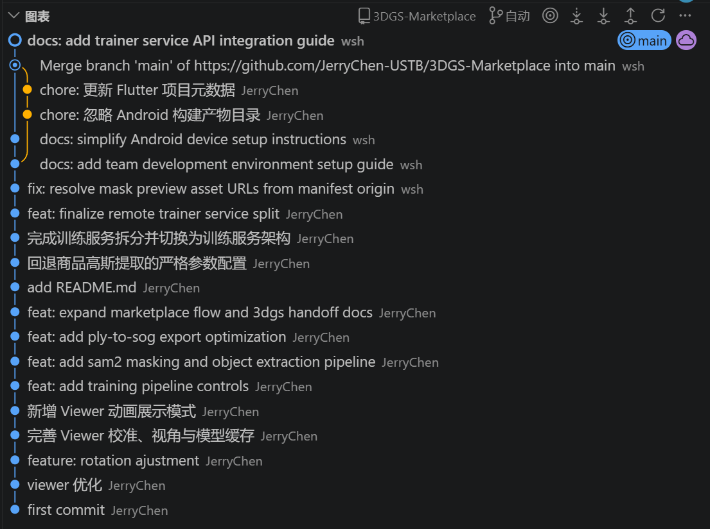
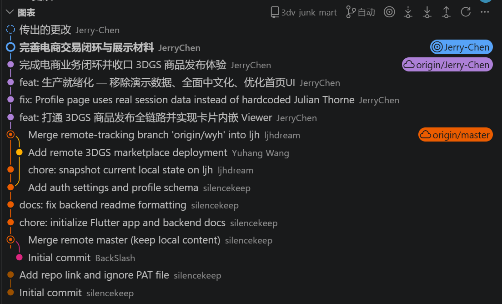

# 人工智能课程报告

> 报告(8)：报告内容完整度 0-2 分，报告撰写质量 0-3 分，AI 工具使用和心得 0-3 分；报告中应包含团队成员具体分工、贡献比例及详细开发文档，说明和记录包括需求分析、系统设计、开发记录、测试、代码质量与版本控制(鼓励团队合作开发)、部署过程在内的完整开发流程

## 项目名称：转物3D

## 项目概述

### 一、项目背景

近年来，二手交易市场快速增长，越来越多的用户倾向于通过线上平台买卖闲置物品。然而，当前主流的二手交易平台在商品展示方面仍以图片和短视频为主，买家在购买前往往难以全面了解商品的实际外观和细节状况。这种信息不对称不仅降低了买家的购买信心，也增加了因"货不对板"而产生退换纠纷的概率。

与此同时，三维重建技术在近年取得了突破性进展。3D 高斯散射（3D Gaussian Splatting, 3DGS）技术能够从一段普通的手机视频中，快速生成高质量的三维模型，并在浏览器中实时渲染，为商品的立体化展示提供了切实可行的技术基础。

**转物3D** 正是在这一背景下诞生的——将前沿的三维重建能力融入二手交易场景，让卖家用手机"转一圈"就能生成商品的 3D 模型，让买家在下单前像拿在手中一样 360° 查看商品，从而构建一个更透明、更可信赖的二手交易体验。

### 二、产品定位

**转物3D** 是一款面向个人用户的二手商品交易平台，其核心差异化在于：卖家只需用手机环绕商品拍摄一段短视频，平台即可自动将其重建为可交互的 3D 模型，嵌入商品详情页供买家全方位查看。

产品名称"转物"取双重含义：**"转"** 既是转让闲置之物，也是转动视角查看商品；**"物"** 是物品，也是万物皆可转的愿景。

### 三、核心功能

#### 3.1 3D 商品展示

平台的核心亮点功能。卖家上传商品视频后，系统自动完成三维重建，生成可在商品详情页内嵌入的 3D 交互模型。买家可以通过手指拖动实现 360° 环绕旋转，双指缩放观察细节，获得"拿在手中查看"的沉浸式体验。

#### 3.2 三维重建工作流

平台为卖家提供了完整的三维重建管理流程：

- **视频上传**：卖家用手机环绕拍摄商品短视频并上传；
- **自动重建**：系统自动进行视频处理、位姿恢复和 3D 模型训练；
- **前景提取**（可选）：支持智能分割，将商品从背景中提取出来，获得更干净的展示效果；
- **模型校准**：卖家可在线调整模型的朝向和展示角度，确保商品以最佳姿态呈现；
- **一键发布**：校准完成后直接发布为商品上架。

#### 3.3 完整的电商交易链路

在 3D 展示之外，转物3D 提供了完整的二手交易闭环：

- **用户体系**：支持账号登录和游客浏览模式；
- **商品浏览**：首页推荐、分类浏览、关键词搜索与多维度筛选；
- **买卖沟通**：内置即时消息系统，买卖双方可针对商品随时交流；
- **交易流程**：下单结算 → 卖家发货 → 物流追踪 → 买家确认收货，全流程可追溯；
- **信任体系**：交易完成后支持评价打分，积累用户信用；
- **账户服务**：钱包余额管理、会员等级体系、通知中心、收货地址管理等。

#### 3.4 双角色支持

平台同时服务买家和卖家两个角色：

- **买家**：浏览商品、3D 查看、咨询卖家、下单购买、确认收货、发表评价；
- **卖家**：上传视频、管理重建任务、校准模型、发布商品、处理订单、发货履约。

### 四、设计目标

#### 4.1 降低信息不对称

通过 3D 模型展示，让买家在购买前能够全方位、无死角地了解商品的真实外观，减少因图片美化或拍摄角度有限而产生的认知偏差，从根本上降低交易纠纷率。

#### 4.2 极简的卖家操作门槛

三维重建技术本身具有较高的专业门槛，但转物3D 的设计目标是将这一过程完全自动化——卖家无需了解任何三维建模知识，只需"拍一段视频、等一会儿、调一下角度"即可完成从拍摄到上架的全过程。

#### 4.3 流畅的买家体验

3D 模型在商品详情页中以内嵌方式展示，买家无需跳转到外部应用或安装额外插件。交互操作（旋转、缩放、平移）跟随手势自然响应，加载速度经过优化，力求在移动网络环境下也能快速呈现。

#### 4.4 完整的交易闭环

产品不仅仅是一个 3D 展示工具，而是一个功能完整的交易平台。从商品发现到下单支付、从物流追踪到收货评价，所有环节在平台内一站式完成，确保交易过程安全、可追溯。

#### 4.5 可信赖的交易环境

通过用户信用体系、交易评价机制和完整的订单生命周期管理，构建买卖双方之间的信任基础。平台记录每一笔交易的完整轨迹，为可能出现的争议提供清晰的处理依据。

### 五、目标用户

- **卖家**：有闲置物品需要出售的个人用户，希望用更直观的方式展示商品以提高成交率；
- **买家**：追求购物安全感的二手商品消费者，希望在下单前充分了解商品实际状况；
- **典型场景**：数码产品、手办模型、vintage 服饰配件、家居小物等对外观细节敏感的品类。

### 六、产品愿景

**让每一件闲置好物都值得被"转"着看。**

转物3D 致力于用三维重建技术重新定义二手交易中的商品展示体验，让线上购买闲置物品不再是一场关于信任的赌注，而是一次眼见为实的放心选择。

## 开发记录

### 一、AI工具

本项目开发过程中主要使用了 Codex、ChatGPT、Gemini 和 Antigravity 四类 AI 工具，分别承担代码实现、方案设计、环境配置指导和 UI 辅助优化等任务。AI 工具不是简单用于生成文本，而是深度参与了需求拆解、代码修改、问题定位、运行环境排查、部署说明和报告材料整理等环节。

| AI 工具 | 使用方式 | 主要用途 |
| --- | --- | --- |
| **Codex** | 主要使用 GPT-5.4 和 GPT-5.5 模型 | 项目开发主力工具，负责制定实施计划、阅读代码、实现功能、数据库设计、后端接口补齐、Flutter 页面开发、部署脚本整理、Bug 修复和报告文档撰写 |
| **ChatGPT** | ChatGPT Web 端，使用 GPT-5.4 模型 | 负责前期方案设计、3DGS 工具链可行性评估、竞品调研、资料搜集和技术路线讨论 |
| **Gemini** | Google AI Studio，使用 Gemini-3.1-Pro-preview 模型 | 负责开发环境配置指导，例如 Android Studio 安装、Flutter 真机调试、移动端开发环境排错等 |
| **Antigravity** | 主要使用 Claude-Opus-4.6 模型 | 辅助 Codex 做界面审美调整、UI 细节优化和部分前端交互改进 |

整体上，项目采用“人负责目标、边界和验收，AI 负责检索、规划、实现和排错”的协作方式。对于复杂任务，先要求 AI 阅读当前代码和文档，再输出可执行计划；对于代码修改，则要求 AI 直接在工程中实施并运行测试；对于报告材料，则用 AI 整理项目历史、功能说明和典型提示词。

### 二、开发环境与技术栈

#### 1. 开发环境

本项目采用前后端分离架构进行开发，开发工作主要在 Windows 平台上完成。

**代码编辑与开发工具：**

- **Visual Studio Code**：主力开发 IDE，安装 Flutter、Dart、Python 等插件，用于前端 Flutter 代码编写、后端 Python 代码编写，以及 3D Viewer 前端（HTML/CSS/JavaScript）的开发与调试。日常开发中通过 VS Code 内置的 Flutter 插件直接连接 Android 真机进行调试运行。
- **Android Studio**：辅助开发工具，主要用于 Android 模拟器的管理与模拟调试，以及 Android SDK、Gradle 构建工具链的配置管理。项目使用 Android Gradle Plugin 8.11.1 和 Kotlin 2.2.20 进行 Android 工程构建。
- **Android 真机调试**：通过 USB 连接 Android 设备，使用 `adb reverse tcp:8000 tcp:8000` 建立端口映射，使手机端可直接通过 `localhost:8000` 访问本地后端服务。
- **Git**：版本控制工具，项目托管于 Git 仓库进行协作管理。

**运行环境：**

- **Python 3.13**：业务后端运行环境，通过 `venv` 创建隔离的虚拟环境管理依赖。
- **Python 3.10**（Conda 环境）：三维重建训练流水线运行环境，运行于远程 GPU 服务器上。
- **Flutter SDK ≥ 3.38.0**（Dart SDK ≥ 3.11.4）：移动端应用开发框架。
- **CUDA 11.8 + NVIDIA GPU**：三维重建训练所需的 GPU 计算环境，部署于远程训练服务器。

---

#### 2. 前端技术栈（移动端）

移动端应用基于 **Flutter** 框架开发，采用 Dart 语言编写，面向 Android 平台构建（项目结构同时保留了 iOS、Web、Windows 等平台的支持能力）。

| 依赖包               | 版本     | 用途                                           |
| -------------------- | -------- | ---------------------------------------------- |
| Flutter SDK          | ≥ 3.38.0 | 跨平台 UI 框架                                 |
| Dart SDK             | ≥ 3.11.4 | 编程语言运行时                                 |
| `http`               | 1.6.0    | HTTP 客户端，用于与后端 REST API 通信          |
| `webview_flutter`    | 4.13.1   | WebView 组件，用于在 App 内嵌入 3D Viewer 页面 |
| `image_picker`       | 1.2.1    | 图片/视频选择器，用于拍摄和选取商品视频与照片  |
| `shared_preferences` | 2.5.5    | 本地键值存储，用于持久化用户会话信息           |
| `image`              | 4.8.0    | 图片处理库，用于图像编解码操作                 |
| `http_parser`        | 4.1.2    | HTTP 报文解析工具                              |
| `cupertino_icons`    | 1.0.9    | iOS 风格图标资源                               |

前端采用 **特性模块化**（Feature-based）的代码组织方式，按业务功能划分为认证（auth）、首页（home）、搜索（search）、商品（listings）、聊天（chat）、交易（commerce）、卖家（sell）、个人中心（profile）、三维重建（reconstructions）、3D 查看器（viewer）等独立模块，各模块通过统一的 API 客户端层与后端通信。

---

#### 3. 后端技术栈

后端基于 **Python FastAPI** 框架构建，提供 RESTful API 服务，采用 JSON 格式进行前后端数据交换。

| 依赖包              | 版本    | 用途                                             |
| ------------------- | ------- | ------------------------------------------------ |
| `fastapi`           | 0.135.3 | 异步 Web 框架，提供 API 路由和请求处理           |
| `uvicorn[standard]` | 0.44.0  | ASGI 服务器，运行 FastAPI 应用                   |
| `pydantic`          | 2.12.5  | 数据校验和序列化，定义 API 请求/响应数据模型     |
| `httpx`             | 0.28.1  | 异步 HTTP 客户端，用于调用远程训练服务和反向代理 |
| `python-multipart`  | 0.0.24  | 处理文件上传的 multipart 表单数据                |

**数据存储：**

- **SQLite**：业务数据持久化存储，包括用户、商品、订单、聊天、评价、钱包等全部电商实体数据。存储文件位于 `storage/db/business.db`，通过线程本地连接（`threading.local()`）保障多线程并发安全。
- **JSON 文件存储**：三维重建任务的状态元数据以独立 JSON 文件形式存储于 `storage/tasks/` 目录，通过文件锁机制确保训练流水线进程与后端服务之间的并发读写安全。
- **文件系统**：上传的视频、生成的模型文件、封面图片等二进制资源直接存储于本地文件系统的 `storage/` 目录下，后端通过 FastAPI 的静态文件挂载功能对外提供访问。

**反向代理机制：** 后端在 `/proxy/storage/*` 路径实现了对远程训练服务器的反向代理，解决移动端通过 USB 调试时无法直接访问校园网内部训练服务器的问题，确保手机端 WebView 可正常加载远程服务器上的 3D 模型文件。

---

#### 4. 3D Viewer 技术栈

3D 商品查看器是一个独立的 Web 前端应用，通过 Flutter 端的 WebView 组件嵌入到 App 中展示。

| 技术                                   | 版本   | 用途                                                         |
| -------------------------------------- | ------ | ------------------------------------------------------------ |
| **PlayCanvas Engine**                  | 2.17.2 | 3D 渲染引擎，支持 Gaussian Splat（GSplat）模型格式的实时渲染 |
| HTML5 / CSS3 / JavaScript (ES Modules) | —      | Viewer 界面构建与交互逻辑                                    |
| IndexedDB                              | —      | 浏览器端模型缓存，避免重复下载大体积模型文件                 |

PlayCanvas 引擎通过 CDN（jsDelivr）以 ES Module 方式加载，Viewer 支持 `.ply`（PLY 点云）和 `.sog`（压缩高斯散射）两种模型格式。交互功能包括：轨道相机控制（单指旋转、双指缩放/平移/扭转）、模型校准工具（旋转 Gizmo、平移 Gizmo、参考网格）、初始展示视角设定、360° 自动旋转动画等。

---

#### 5. 三维重建技术栈

三维重建流水线部署于配备 NVIDIA GPU 的远程训练服务器上，负责将用户上传的商品视频自动转化为可交互的 3D 模型。

| 技术 / 依赖                           | 版本              | 用途                                                         |
| ------------------------------------- | ----------------- | ------------------------------------------------------------ |
| **Nerfstudio**                        | 1.1.5             | 神经辐射场训练框架，使用其中的 Splatfacto 方法训练 3DGS 模型 |
| **COLMAP**                            | —                 | 运动恢复结构（SfM）工具，从视频帧中恢复相机位姿              |
| **SAM 2**（Segment Anything Model 2） | GitHub 源码版     | Meta 开源的图像分割模型，用于商品前景自动提取                |
| **gsplat**                            | 1.4.0             | 高斯散射 CUDA 渲染内核，加速 3DGS 训练                       |
| **PyTorch**                           | 2.1.2 (CUDA 11.8) | 深度学习框架                                                 |
| **FFmpeg**                            | —                 | 视频预处理工具，负责视频归一化、抽帧、分辨率调整             |
| **Open3D**                            | 0.19.0            | 3D 数据处理库，用于点云操作和模型后处理                      |
| NumPy                                 | 1.26.4            | 数值计算基础库                                               |
| SciPy                                 | 1.15.3            | 科学计算库                                                   |
| Pillow                                | 12.2.0            | 图像处理库                                                   |
| plyfile                               | 1.1.3             | PLY 格式点云文件读写                                         |

训练流水线支持四种质量档位（fast / balanced / quality / raw），可根据设备算力和精度需求灵活选择。流水线的核心处理流程为：FFmpeg 视频预处理（归一化、3fps 抽帧、分辨率调整） → COLMAP SfM 位姿恢复 → （可选）SAM2 对象分割前景提取 → Nerfstudio Splatfacto 训练 → PLY 模型导出 → SOG 格式转换。

---

#### 6. 部署环境

生产环境部署于 Linux 服务器，采用标准的进程管理和反向代理方案：

| 组件          | 用途                                                         |
| ------------- | ------------------------------------------------------------ |
| **Nginx**     | 反向代理，将 HTTP 请求转发至后端（:8000）和训练服务（:9000），处理静态资源缓存和上传大小限制 |
| **systemd**   | 进程管理，配置了后端服务、训练服务、定时备份和健康检查四类 service/timer 单元 |
| **logrotate** | 日志轮转，防止日志文件无限增长                               |

----

### 三、团队协作开发记录

#### 1. 团队成员与总体分工

本项目团队共 3 人，队长为陈家煜，队员为李佳昊和李恒（留学生）。团队采用“队长负责关键技术路线与最终集成，队员分阶段承担业务开发、测试和材料整理”的协作方式推进。由于项目同时包含 3DGS 三维重建工作链和二手电商业务系统两部分，实际开发过程也分成了“3DGS 技术验证”“电商平台开发”“系统集成收口”“测试与展示材料整理”几个阶段。

| 成员 | 主要职责 | 贡献比例 |
| --- | --- | --- |
| 陈家煜（队长） | 负责产品 Insight、方案设计、可行性分析、实施计划制定；打通 3DGS 工作链并部署远程训练服务；后期接手完成 3DGS 与电商平台整合，补齐聊天议价、交易链路、订单售后、3DGS 发布闭环和最终成果收口；负责收集截图、录屏等展示材料，制作展示视频，撰写课堂展示讲稿，制作PPT，进行汇报展示 | 54% |
| 李佳昊 | 负责电商业务早期开发；在 `3D-Junk-Mart` 仓库中完成后端业务框架初步搭建、数据库设计和前端 UI 设计；接收 3DGS demo 后进行初步整合，并将 demo 副本放入 `3dv-junk-mart/3dgs-ref` 作为参考开发资料 | 36% |
| 李恒（留学生） | 负责后期测试体验，向其他成员反馈问题、提出修改意见，并协助完成产品截图、录屏等展示材料收集整理，撰写部分展示文案 | 10% |

#### 2. 开发过程与团队协作

项目初期由队长陈家煜完成产品 Insight、方案设计、可行性分析和实施计划制定，并先行打通 3DGS 工作链。该阶段形成了独立的 `3DGS-Marketplace` demo，覆盖视频输入、远程训练服务、Mask、模型导出和 Web Viewer 展示等关键能力，并部署到了远程 GPU 服务器，为后续电商系统接入预留接口。



随后，陈家煜将 `3DGS-Marketplace` 交付给李佳昊。李佳昊在 `3D-Junk-Mart` 仓库中推进电商业务开发，完成了后端业务框架初步搭建、数据库设计和前端 UI 设计。为了便于后续整合，他将 3DGS demo 的 zip 副本放入当前项目的 `3dv-junk-mart/3dgs-ref` 目录，作为 AI 工具和人工开发共同参考的原型工程。李佳昊进行了初步整合，但由于 3DGS 工作链涉及远程 GPU 服务、任务状态同步、模型资源代理、Mask 交互和 Viewer 校准等多个环节，后续集成工作由更熟悉该链路的陈家煜接手。

陈家煜接手后，完成了 3DGS 工作链与电商业务的正式整合，并进一步补齐原先较静态的电商业务功能，包括聊天与议价、按成交价下单、订单履约、卖家发货、买家确认收货、退款售后、评价、钱包、会员、通知和个人中心等模块。项目最终从“3DGS demo + 电商页面原型”逐步演进为可直接安装体验的 APK 成果。



李恒加入团队较晚，主要承担后期测试和展示材料整理工作。他从真实用户体验角度检查 APK 的登录、浏览、搜索、详情、聊天、下单、退款、个人中心和 3DGS 发布流程，向其他成员反馈问题并提出修改意见，同时协助整理产品截图、录屏和部分展示文案。该部分工作帮助团队发现演示链路中的断点，使最终成果更适合作为课程项目展示。

#### 3. Git 使用与版本控制情况

本项目使用 Git 和 GitHub 进行版本管理，开发过程中主要涉及两个仓库：

| 仓库 | 作用 |
| --- | --- |
| https://github.com/JerryChen-USTB/3DGS-Marketplace.git | 陈家煜早期打通 3DGS 工作链的原型仓库，用于验证远程训练服务、Viewer、Mask、模型导出和服务接口 |
| https://github.com/JerryChen-USTB/3D-Junk-Mart.git | 最终产品仓库，用于开发 Flutter 移动端、FastAPI 后端、电商业务、3DGS 接入、展示材料和课程报告 |

Git 在协作中主要用于记录阶段性交付、保留技术参考和支持分支接力开发。陈家煜通过 `3DGS-Marketplace` 仓库沉淀 3DGS 原型，李佳昊通过 `3D-Junk-Mart` 推进电商业务基础建设，后续陈家煜在当前主工程中完成整合与收口。Git 历史中，`JerryChen` 的提交对应陈家煜完成的 3DGS 技术攻坚、远程训练服务、最终整合和成果收口；其余作者记录主要对应李佳昊早期电商平台开发与整合尝试。整体来看，团队通过 GitHub 仓库交付、参考副本保留、分支协作和测试反馈完成了从技术验证到最终 APK 成果的协同开发。

## 系统设计（重点）

> 重点撰写这一部分，包括需求分析、系统设计、详细功能介绍与使用文档等

### 一、需求分析

### 二、系统设计

### 三、详细功能介绍

### 四、使用文档

## 开发技巧与心得总结（重点）

> 重点撰写这一部分，结合实际使用过程和样例，总结利用AI工具解决问题的实践经验、收获和心得等

本部分已整理为独立文档，见：[开发技巧与AI工具使用心得总结.md](./开发技巧与AI工具使用心得总结.md)。

## 其他补充材料

### 一、AI开发提示词

#### 1. 前期产品调研与可行性分析

```text
我想要做一个移动端的 3D Gaussian Splatting 的平台，主要是用户可以直接调用手机摄像头拍摄物体或场景，然后上传到服务器训练，完成后返回到客户端进行渲染，这样的一条龙服务降低了配置成本，用户不用折腾就可以轻松体验，并附加分享、点赞等社区功能。

请你帮我调研一下，现在是否已经有了同类产品。
```

#### 2. Object Masking 方案讨论

```text
本项目是一个基于 3DGS 的移动端二手商品交易平台 MVP：Flutter App 作为入口，FastAPI 后端接收视频并创建重建任务，训练链使用 COLMAP + nerfstudio/splatfacto 从用户环绕拍摄的视频生成 3DGS 模型，最后通过 PlayCanvas Web Viewer 在 Flutter WebView 中查看模型。

现在我准备给 3DGS 训练的流水线引入 Object Masking，最终达到的效果是重建的结果只保留物体本身，去除背景环境。

我准备在 COLMAP 完成后，引入 Sam 2 做图像分割生成掩码，用户在第一帧选择要保留（追踪）的物体。请你帮我分析一下这个想法可行性，然后制定方案。
```

#### 3. 搭建 3D 商品发布业务骨架

```text
现在请完成一项新的复杂工作：我现在的 3DGS 的 Pipeline 已经基本跑通了，从上传视频到在手机上用 viewer 查看和编辑，以及基础的任务管理功能。我即将把当前工作交付给队员，他们需要开发具体的电商业务，接入我的 3DGS 流水线。在此之前，请你先搭起来一个基础的框架，模拟“闲鱼”电商平台，从而让他们知道这个流水线具体是怎么应用的。

你需要完成以下工作：
1. 卖家的发布 3D 商品模块：做一个分步指引卖家完成 3D 商品发布的模块，包括上传视频、训练配置、数据预处理、Object Masking、训练、Viewer 校准、动画预览和确认发布。
2. 卖家的 3D 商品管理模块：卖家管理自己的所有商品，可以重新进入 viewer 编辑，可以删除商品。
3. 买家查看 3D 商品模块：制作一个 3D 商品详情页，嵌入横屏 viewer，可以与窗口交互。
4. 制作底部导航栏，分为“首页”和“我的”两页，中央按钮进入发布 3D 商品流程。
5. 设置开发者入口，把当前所有调试页面收拢到一个按钮中。
```

#### 4. 相机采集能力分析

```text
新增功能（讨论）：发布商品第一步调用手机摄像头录像，对相机参数进行控制。

在进行 3DGS 重建时，对拍摄的质量和标准有很高的要求。但是考虑到安卓手机的型号非常多，我不太清楚我们能实施的对相机的控制有多少，请你帮我调用、分析一下。
```

#### 5. 环境搭建与交接文档

```text
现在请你完成一项重要的交接文档工作。

项目背景：
我已经完成了本项目当前阶段的核心能力，包括 3DGS 重建流水线、基础 App 框架、上传视频、任务管理、Object Masking、训练、Viewer 查看与编辑等能力。

你的任务：
请你基于当前项目代码、docs 文档、配置文件、脚本、依赖声明以及我本机当前环境信息，编写一份新的、完整的 Markdown 交接文档，目标是让一个新同学能够从零开始把本项目环境搭起来，并成功跑通当前 MVP。

文档必须结合当前项目真实情况来写，命令、路径、版本、依赖、环境变量、启动顺序、常见坑都尽量从项目当前代码和配置中核实后再写。
```

#### 6. 完整电商业务收口计划

```text
当前工作区有两个项目：`3DGS-Marketplace` 是我最早已经跑通的参考实现，`3dv-junk-mart` 是当前继续开发的主项目。这个项目是一个基于 3DGS 的二手商品交易平台，后端和 Flutter 本地联调链路已经打通，远程 3DGS 训练服务运行在 `http://222.199.216.192:9000`。

现在，请你在当前项目的基础上，实现完整的电商业务。请你基于当前 `3dv-junk-mart` 项目的实际代码和现状，先全面梳理项目结构、现有能力、未完成部分和主要风险，然后制定一份系统、详细、可执行的任务计划，目标是把它推进到可直接面向用户展示的高完整度电商产品状态。先不要空谈方案，先读代码、看清当前进度，再给出高质量计划，并在后续聊天中按计划逐步实施。
```

#### 7. 多问题一次性修复

```text
下面是一些 Bug 汇总和非 Bug 的需要调整的地方，请你制定一份计划，进行一次性修复。

Bug 汇总：
1. 商品的属主在商品详情页不应出现 "Buy now"、"Contact"、"Reviews" 选项。
2. 点击 "Contact" 后进入的会话详情页面有问题，顶部卡片错位，点击没反应，无法聊天。
3. 更新头像后，在 Profile 页面头像更新了，但是在 Profile settings 页面没有更新。
4. 已经设置了 location，但是商品卡片上仍然是 "Unknown location"。
5. 搜索页面点击 Search 没反应，需要离开搜索页面再回来才看到搜索结果。
6. 商品详情页面，商家的头像没有显示出来。

需要调整的地方：
1. 登录注册页面输入文字排版有问题，需要与左侧图标对齐。
2. 移除登录界面顶部无用提示卡片。
3. 所有文字换成中文，不保留英文。
4. 调整 Profile 页面顶部卡片布局。
5. Profile settings 页面缩小每个选项卡高度。
6. 退出登录时先弹窗询问是否退出。
```

#### 8. 商品封面与商品管理优化

```text
做如下改进：

1. 在发布商品时，加入一个添加商品封面的选项，让用户拍照或上传图片，注意控制封面尺寸。
2. 完善商品管理，增加修改商品信息和删除商品的功能。
3. 商品卡片默认展示商品封面，当用户触摸图片区域时才加载 viewer 变成当前的效果；当用户触摸另一个商品图片时，在加载新 viewer 之前先清理刚才的 viewer，减少内存占用。
```

### 二、测试记录

本项目测试工作分为自动化测试和人工验收两部分。自动化测试主要用于保证后端业务规则、前端关键页面和部署脚本的稳定性；人工验收主要面向最终 APK 成果，重点检查真实移动端环境下的功能闭环、页面交互和 3D 商品展示体验。

#### 1. 测试范围

测试范围覆盖项目的核心业务链路和 3DGS 特色能力，主要包括：

| 测试类别 | 测试内容 |
| --- | --- |
| 基础访问与账号 | 游客浏览、注册、登录、退出登录、游客权限拦截 |
| 商品浏览 | 首页推荐、分类入口、搜索筛选、商品卡片、商品详情页 |
| 3D 展示 | 3D 商品标识、详情页内嵌 Viewer、模型加载、旋转与缩放交互 |
| 聊天与议价 | 创建会话、发送消息、快捷话术、发起议价、接受议价、按议价金额下单 |
| 交易链路 | 地址管理、结算、模拟支付、订单取消、卖家发货、买家确认收货 |
| 售后与评价 | 申请退款、卖家同意退款、纠纷状态、完成订单后的评价 |
| 配套功能 | 收藏、通知、钱包流水、会员、个人资料、卖家商品管理 |
| 部署与服务 | 后端健康检查、部署配置、备份脚本、远程 3DGS 服务连通性 |

#### 2. 自动化测试记录

项目中保留了后端、前端和部署相关的自动化测试文件，用于在功能迭代后快速检查关键业务逻辑是否被破坏。

| 测试模块 | 文件 | 主要覆盖内容 | 测试结果 |
| --- | --- | --- | --- |
| 后端交易矩阵测试 | `tests/test_backend_matrix.py` | 空市场启动、游客会话、注册登出、聊天、订单取消、议价下单、退款、纠纷、评价、钱包、会员、通知、3DGS 重建任务鉴权 | 通过 |
| 部署工件测试 | `tests/test_deployment_artifacts.py` | 部署配置文件、运行时环境变量、数据库备份脚本、健康检查脚本 | 通过 |
| 远程 3DGS 连通性测试 | `tests/test_remote_3dgs_connectivity.py` | 远程训练服务健康检查、任务列表读取、Viewer 配置回写 | 默认跳过，需要手动开启 |
| Flutter 页面测试 | `app/test/widget_test.dart` | 登录后进入“我的”页面并打开个人设置 | 通过 |
| Flutter 聊天测试 | `app/test/chat_page_test.dart` | 聊天输入区、议价按钮、卖家视角下单权限、议价卡片订单状态 | 通过 |
| Flutter 订单测试 | `app/test/order_detail_test.dart` | 订单申请退款、取消未支付订单、已发货订单退款、卖家同意退款 | 通过 |

本次整理报告前，对当前工程重新执行了自动化测试，结果如下：

```powershell
cd D:\Projects\3dv-junk-mart
python -m unittest discover
```

运行结果为 `Ran 16 tests`，`OK (skipped=2)`。其中跳过的 2 个用例为远程 3DGS 连通性测试，因为该测试依赖远程训练服务和网络环境，默认需要通过环境变量 `RUN_REMOTE_3DGS_CONNECTIVITY_TESTS=1` 手动开启。测试过程中出现了少量 SQLite 连接未关闭的 `ResourceWarning`，不影响本次测试通过，但可作为后续代码质量优化项。

```powershell
cd D:\Projects\3dv-junk-mart\app
flutter test
```

运行结果为 `All tests passed!`，共 9 个 Flutter Widget 测试通过。该结果说明当前前端关键页面在测试桩数据下可以正常构建和交互，聊天、订单详情和个人中心等重点页面没有出现红屏或断言失败。

#### 3. 人工验收记录

由于本项目最终交付形式是可直接安装使用的 Android APK，自动化测试只能覆盖一部分逻辑，最终仍需要通过真机进行端到端体验验证。人工验收主要依据 `docs/验收清单.md` 进行，按照 `P0 主链路 -> P1 配套能力 -> P2 3D 特色能力` 的顺序执行。

| 验收级别 | 验收内容 | 验收情况 |
| --- | --- | --- |
| P0 主链路 | 登录/注册、首页浏览、搜索筛选、商品详情、聊天、议价、下单、模拟支付、发货、收货、退款 | 主流程可完成，关键页面可正常进入，交易状态能够随操作推进 |
| P1 配套能力 | 收藏、通知、地址管理、钱包流水、会员、个人资料、卖家商品管理 | 配套功能可支撑完整交易体验，关键数据在页面刷新后仍能保持一致 |
| P2 3D 能力 | 3D 商品标识、详情页 Viewer、已有 3D 模型展示、3DGS 商品发布链路 | 已有 3D 商品可以在 App 内查看；3DGS 发布链路依赖远程训练服务，按可用网络环境进行验证 |
| 稳定性与体验 | Android 窄屏布局、键盘弹起、页面返回、空态、加载态、错误态 | 经过多轮真机调试后，阻塞级问题已修复，页面整体满足展示和体验要求 |

人工测试中特别关注移动端真实体验中的问题，例如小屏幕布局溢出、底部按钮被遮挡、键盘弹起后聊天输入区不可见、页面返回后状态丢失、商品属主看到买家操作入口等。这些问题往往难以完全依靠单元测试发现，需要通过 APK 真机操作、截图和录屏进行确认。

#### 4. 典型问题与修复闭环

在一次真机调试后，团队集中整理了一批 Bug 和体验问题，并通过 Codex 辅助进行批量修复。典型问题包括：

- 商品属主在自己的商品详情页不应看到“立即下单”“联系卖家”等买家操作入口。
- 点击商品详情页的联系入口后，会话详情页顶部卡片错位，且无法正常聊天。
- 更新头像后，部分页面仍显示旧头像，存在状态刷新不一致问题。
- 用户已经设置所在地后，商品卡片仍显示 `Unknown location`。
- 搜索页点击搜索后结果没有立即刷新，需要离开页面再回来才能看到变化。
- 登录注册页面输入框文字与图标未对齐，部分英文文案未完全中文化。

修复后重新执行了自动化测试，`flutter test` 和 `python -m unittest discover` 均通过；同时在真机上复查聊天、搜索、商品详情、个人资料、退出登录等受影响流程，确认阻塞问题已经消除。该过程形成了“真机发现问题 -> 整理问题清单 -> 代码修复 -> 自动化测试回归 -> 真机复验”的闭环。

#### 5. 测试结论

综合自动化测试和人工验收结果，项目当前版本已经能够作为完整 APK 成果进行展示和体验。后端核心交易矩阵、Flutter 关键页面、部署脚本均通过自动化测试；Android 真机验收覆盖了从商品浏览、3D 查看、聊天议价到下单、发货、收货、退款和评价的主要业务流程。远程 3DGS 连通性测试由于依赖服务器状态和网络条件，默认未纳入每次自动化回归，但项目已保留独立测试入口，可在远程训练服务可用时单独执行。
