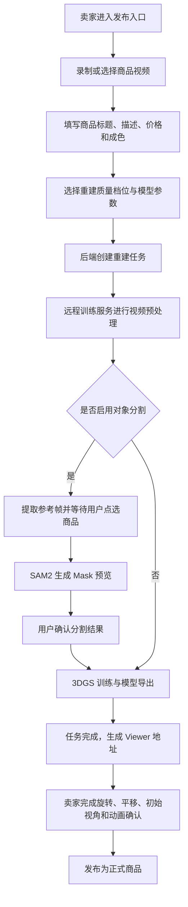
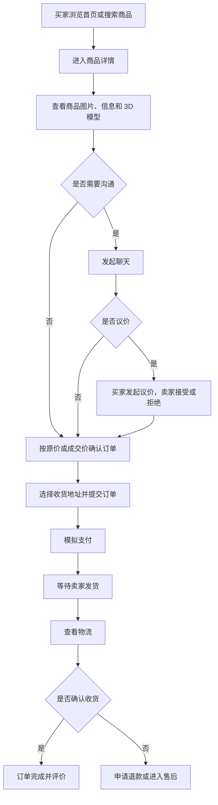
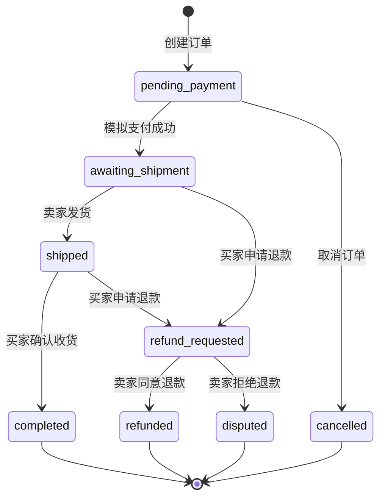

# 系统设计（一）：需求分析

## 1. 项目需求背景

“转物3D”是一个基于 3D Gaussian Splatting（3DGS）的 3D 二手商品交易平台。传统二手交易平台主要依赖图片、文字描述和短视频展示商品，买家往往只能从卖家选择的少数角度判断商品成色、结构和细节，容易产生信息不对称。一旦商品存在划痕、变形、配件缺失或整体观感与图片不一致，就会导致沟通成本上升、交易信任下降以及售后纠纷增加。

本项目的核心需求是将 3DGS 三维重建能力嵌入二手交易场景：卖家只需要使用手机围绕商品拍摄一段短视频，系统即可通过远程 3DGS 训练流水线生成可交互 3D 模型，并将模型嵌入商品详情页。买家在下单前可以旋转、缩放、查看商品整体与局部细节，从而获得比静态图片更充分的商品信息。在此基础上，平台还需要具备完整的电商业务闭环，包括用户登录、商品浏览、搜索筛选、收藏、聊天议价、下单支付、发货、收货、退款、评价、钱包、会员和通知等能力。

因此，本项目并不是单一的三维重建演示程序，而是一个“3D 商品展示能力 + 二手交易业务流程”的综合系统原型。需求分析既要覆盖 3DGS 相关的智能重建链路，也要覆盖真实二手交易平台所需的业务功能。

## 2. 用户角色分析

系统主要面向三类用户：游客、买家和卖家。由于二手交易通常存在“一名用户既可以买也可以卖”的情况，买家和卖家在账号体系上并不需要严格分离，但在具体业务流程中会承担不同角色。

### 2.1 游客

游客指未注册或未登录的访问者。游客的主要需求是低门槛了解平台内容和产品效果，因此系统需要允许游客浏览首页、查看商品列表、搜索商品、进入商品详情页并体验已有商品的 3D 预览。游客不应被强制登录后才能看到平台价值，否则会增加初次使用成本。

同时，游客不能执行涉及交易安全和用户身份的操作，例如发布商品、收藏商品、发起聊天、议价、下单、管理订单或修改个人资料。当游客触发这些功能时，系统需要引导其进入登录或注册流程。

### 2.2 买家

买家是有二手商品购买需求的用户。买家的核心诉求包括：

- 更全面地了解商品真实状态，降低“货不对板”的风险。
- 能够快速发现符合需求的商品，包括首页推荐、关键词搜索、筛选和排序。
- 能够在下单前与卖家沟通商品细节、议价并确认交易条件。
- 能够完成下单、模拟支付、查看物流、确认收货和评价。
- 在交易不符合预期时，能够申请退款或发起纠纷。

买家侧最关键的差异化需求是 3D 商品查看。平台需要让买家在商品详情中通过 3D Viewer 对商品进行旋转、缩放和平移观察，使买家能够从多个角度确认商品外观、结构和细节。

### 2.3 卖家

卖家是希望出售闲置物品的用户。卖家的核心诉求包括：

- 以更可信、更直观的方式展示二手商品，提高成交率。
- 尽可能降低三维建模门槛，不要求掌握专业建模、摄影测量或 3DGS 训练知识。
- 能够上传商品视频，查看重建任务状态，在必要时完成对象分割和模型校准。
- 能够填写商品标题、描述、价格、成色、封面等信息，并将 3D 重建结果发布为商品。
- 能够处理买家咨询、议价请求、订单发货和退款售后。

卖家侧最关键的需求是“手机拍摄到 3D 商品发布”的低门槛流程。平台需要把视频预处理、COLMAP 位姿恢复、SAM2 前景分割、3DGS 训练和模型导出等复杂技术细节封装在后端和远程训练服务中，卖家只需要按步骤操作。

## 3. 功能性需求

根据角色和业务流程，系统功能性需求可划分为用户体系、商品浏览、3DGS 重建发布、聊天议价、交易履约、售后评价和账户服务七个模块。

### 3.1 用户体系模块

| 编号 | 功能需求 | 说明 |
| --- | --- | --- |
| F-01 | 用户注册 | 用户通过账号标识、昵称和密码创建账号，注册成功后可进入平台主页 |
| F-02 | 用户登录 | 用户输入账号与密码完成身份验证，登录后客户端保存会话凭证 |
| F-03 | 游客模式 | 未登录用户可以浏览首页、搜索和查看商品详情，触发交易行为时提示登录 |
| F-04 | 退出登录 | 用户主动退出当前会话，客户端清理本地 token 并返回登录页 |
| F-05 | 会话保持 | 客户端重新打开后能够恢复已登录状态，后端可校验当前会话有效性 |
| F-06 | 个人资料管理 | 用户可查看和编辑头像、昵称、简介、地区、生日等个人资料 |
| F-07 | 收货地址管理 | 用户可新增、编辑、删除收货地址，并设置默认地址供下单时使用 |

### 3.2 商品浏览与搜索模块

| 编号 | 功能需求 | 说明 |
| --- | --- | --- |
| F-08 | 首页浏览 | 首页展示 Banner、平台服务入口、推荐商品、3D 专区商品和商品信息卡片 |
| F-09 | 商品列表 | 支持分页加载商品，展示封面、标题、价格、成色、卖家和是否支持 3D |
| F-10 | 关键词搜索 | 用户可通过搜索框输入关键词查找商品 |
| F-11 | 热门搜索与建议 | 搜索页展示热门关键词和搜索建议，降低用户输入成本 |
| F-12 | 筛选与排序 | 支持按价格区间、成色、分类、是否包含 3D 模型等条件筛选 |
| F-13 | 商品详情 | 展示商品基本信息、媒体资源、3D 预览入口、卖家信息、规格、评价和相似商品 |
| F-14 | 商品收藏 | 买家可收藏感兴趣商品，并在个人中心统一查看和管理 |

### 3.3 3DGS 重建与发布模块

| 编号 | 功能需求 | 说明 |
| --- | --- | --- |
| F-15 | 发布入口 | 用户可通过底部导航或个人中心进入卖家发布流程 |
| F-16 | 视频选择与录制 | 卖家可拍摄或选择商品环绕视频，作为 3DGS 重建输入 |
| F-17 | 商品基础信息填写 | 卖家填写标题、描述、价格、成色、分类等商品信息 |
| F-18 | 质量档位选择 | 支持选择重建质量档位，在训练速度、成本和模型质量之间权衡 |
| F-19 | 任务创建 | 后端接收视频与商品信息，创建三维重建任务并保存任务元数据 |
| F-20 | 远程训练启动 | 业务后端调用远程 3DGS Trainer Service 启动预处理和训练 |
| F-21 | 状态跟踪 | 卖家可查看任务状态、进度、当前阶段和错误信息 |
| F-22 | Mask 交互 | 对启用对象分割的任务，卖家可在参考帧中点选商品区域，确认分割结果 |
| F-23 | 模型导出 | 训练完成后生成 PLY/SOG 等可展示模型资产 |
| F-24 | Viewer 校准 | 卖家可依次完成旋转校正、平移校正、初始展示位置设置和动画预览确认 |
| F-25 | 发布为商品 | 任务达到可发布状态后，系统将 3D 模型、封面和商品信息同步为正式商品 |
| F-26 | 任务库管理 | 卖家可查看历史重建任务、继续处理未完成任务或打开已完成模型 |

### 3.4 聊天与议价模块

| 编号 | 功能需求 | 说明 |
| --- | --- | --- |
| F-27 | 创建会话 | 买家在商品详情页点击联系卖家后，系统为买卖双方创建围绕该商品的会话 |
| F-28 | 消息列表 | 用户可查看所有会话的最近消息、商品信息和未读状态 |
| F-29 | 文字聊天 | 买卖双方可发送文字消息，围绕商品细节进行沟通 |
| F-30 | 快捷话术 | 聊天页提供常用问题或快捷输入，减少重复沟通成本 |
| F-31 | 发起议价 | 买家可在聊天中填写期望价格并发送议价请求 |
| F-32 | 处理议价 | 卖家可接受或拒绝议价请求 |
| F-33 | 成交价下单 | 卖家接受议价后，买家可按成交价进入结算流程 |

### 3.5 下单与订单履约模块

| 编号 | 功能需求 | 说明 |
| --- | --- | --- |
| F-34 | 确认订单 | 买家确认商品、价格、收货地址、运费和订单总价 |
| F-35 | 模拟支付 | 项目不接入真实支付渠道，使用模拟支付完成支付状态流转 |
| F-36 | 订单列表 | 买家和卖家可按状态查看相关订单 |
| F-37 | 订单详情 | 展示订单状态、商品信息、买卖双方、付款信息、物流和操作按钮 |
| F-38 | 卖家发货 | 卖家可录入物流公司和物流单号，订单进入已发货状态 |
| F-39 | 物流查看 | 买家可查看物流信息和订单时间线 |
| F-40 | 确认收货 | 买家确认收货后订单完成，商品状态和钱包流水同步更新 |
| F-41 | 取消订单 | 未支付订单允许买家取消，释放商品库存或可售状态 |

### 3.6 售后与评价模块

| 编号 | 功能需求 | 说明 |
| --- | --- | --- |
| F-42 | 申请退款 | 待发货或已发货订单允许买家提交退款申请和原因 |
| F-43 | 卖家处理退款 | 卖家可同意或拒绝退款申请 |
| F-44 | 纠纷状态 | 卖家拒绝退款后，订单可进入纠纷状态，保留后续平台介入扩展空间 |
| F-45 | 退款完成 | 同意退款后订单进入已退款状态，商品恢复可售或按业务规则释放 |
| F-46 | 评价草稿 | 订单完成后，系统可生成评价草稿，买家继续填写评分与评价内容 |
| F-47 | 提交评价 | 买家可提交星级评分、评价标签和文字评价，形成交易信任记录 |

### 3.7 账户服务模块

| 编号 | 功能需求 | 说明 |
| --- | --- | --- |
| F-48 | 个人中心 | 展示用户资料、发布数、售出数、购买数、收藏数和常用服务入口 |
| F-49 | 我的商品 | 卖家可查看自己发布的商品，进入商品管理或订单处理 |
| F-50 | 我的收藏 | 买家可集中查看已收藏商品 |
| F-51 | 钱包 | 展示可用余额、冻结金额和交易流水，包括购买、退款、结算、会员升级等 |
| F-52 | 会员 | 展示会员方案、当前订阅状态，并支持模拟升级 |
| F-53 | 通知中心 | 展示订单、消息、退款、会员等事件通知，支持已读状态管理 |
| F-54 | 徽标摘要 | 首页或底部导航可展示消息、通知、待处理订单等数量提醒 |

## 4. 非功能性需求

| 类别 | 需求说明 |
| --- | --- |
| 可用性 | 浏览、搜索、详情、聊天和订单等电商核心功能应能在远程训练服务不可用时继续使用；新建 3DGS 训练任务依赖远程服务可达 |
| 性能 | 3D Viewer 应能在移动端 WebView 中完成模型加载和基本交互；模型文件应尽量使用缓存和压缩格式降低重复加载成本 |
| 安全性 | 写操作必须校验 Bearer Token；订单、聊天、退款、重建任务等接口需校验用户身份和资源归属，避免越权访问 |
| 数据一致性 | 订单状态、商品状态、钱包流水和通知应在关键业务动作后同步更新；退款后商品可售状态需恢复 |
| 可维护性 | 前端按 feature 组织，后端按 marketplace 与 reconstructions 路由拆分；训练服务与业务后端隔离，降低依赖冲突 |
| 可扩展性 | 当前 SQLite + JSON 文件适合课程项目和演示场景，后续应可迁移至关系型数据库、对象存储和任务队列 |
| 兼容性 | Flutter App 主要面向 Android 真机调试，同时保留跨平台工程结构；Viewer 基于 Web 技术，需兼容主流移动 WebView 内核 |
| 易用性 | 3DGS 发布流程需要将复杂算法步骤转化为可理解的任务状态和操作按钮，避免要求卖家具备三维重建知识 |

## 5. 核心用例图

```mermaid
graph LR
    Guest["游客"]
    Buyer["买家"]
    Seller["卖家"]

    subgraph 用户体系
        UC01["注册"]
        UC02["登录"]
        UC03["游客浏览"]
        UC04["个人资料与地址管理"]
    end

    subgraph 商品浏览
        UC05["浏览首页"]
        UC06["搜索与筛选"]
        UC07["查看商品详情"]
        UC08["3D 模型查看"]
        UC09["收藏商品"]
    end

    subgraph 3DGS发布
        UC10["上传商品视频"]
        UC11["启动重建任务"]
        UC12["Mask 点选与确认"]
        UC13["Viewer 校准"]
        UC14["发布为 3D 商品"]
        UC15["任务库管理"]
    end

    subgraph 聊天交易
        UC16["联系卖家"]
        UC17["文字聊天"]
        UC18["发起/处理议价"]
        UC19["按成交价下单"]
        UC20["模拟支付"]
        UC21["卖家发货"]
        UC22["确认收货"]
    end

    subgraph 售后账户
        UC23["申请退款"]
        UC24["处理退款/纠纷"]
        UC25["发表评价"]
        UC26["钱包"]
        UC27["会员"]
        UC28["通知中心"]
    end

    Guest --- UC01
    Guest --- UC02
    Guest --- UC03
    Guest --- UC05
    Guest --- UC06
    Guest --- UC07
    Guest --- UC08

    Buyer --- UC04
    Buyer --- UC05
    Buyer --- UC06
    Buyer --- UC07
    Buyer --- UC08
    Buyer --- UC09
    Buyer --- UC16
    Buyer --- UC17
    Buyer --- UC18
    Buyer --- UC19
    Buyer --- UC20
    Buyer --- UC22
    Buyer --- UC23
    Buyer --- UC25
    Buyer --- UC26
    Buyer --- UC27
    Buyer --- UC28

    Seller --- UC04
    Seller --- UC10
    Seller --- UC11
    Seller --- UC12
    Seller --- UC13
    Seller --- UC14
    Seller --- UC15
    Seller --- UC17
    Seller --- UC18
    Seller --- UC21
    Seller --- UC24
    Seller --- UC26
    Seller --- UC27
    Seller --- UC28
```

## 6. 关键业务流程需求

### 6.1 3DGS 商品发布流程

### 6.2 买家交易流程

### 6.3 订单状态需求

订单状态需要覆盖从下单到售后的主要生命周期：

## 7. 需求边界

本项目作为《人工智能》课程大作业，重点验证 3DGS 技术与二手电商场景结合的可行性，同时完成可演示的业务闭环。系统存在以下明确边界：

- 支付为模拟支付，不接入真实支付平台。
- 退款为平台内状态流转和钱包流水模拟，不接入真实退款渠道。
- 售后仅覆盖退款申请、同意、拒绝和纠纷状态，不包含退货物流、举证图片和平台仲裁后台。
- 3DGS 新任务训练依赖远程 GPU Trainer Service，网络不可达时无法启动新的端到端训练。
- 当前数据存储使用 SQLite、JSON 文件和本地文件系统，适合课程项目与单机演示，不面向高并发生产环境。
- 当前主工程负责 3DGS 能力的业务集成，完整训练服务参考实现保留在 `3dgs-ref/trainer_service/`。
