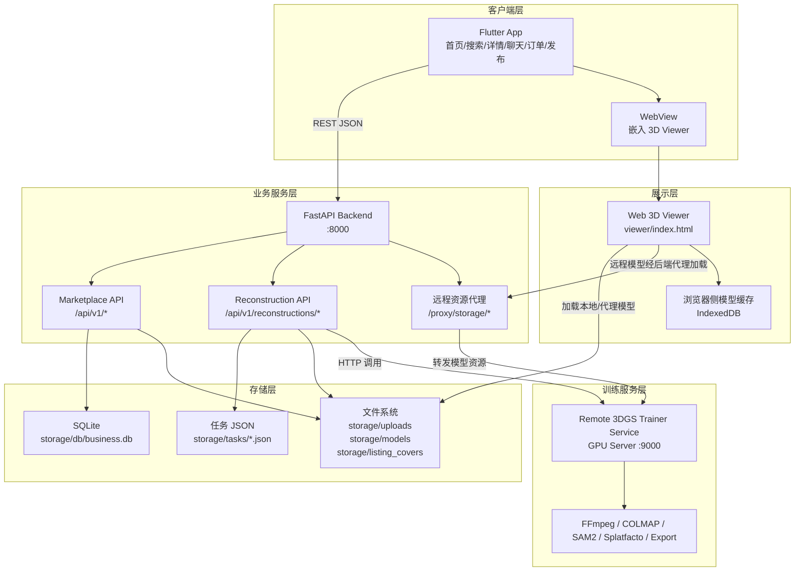
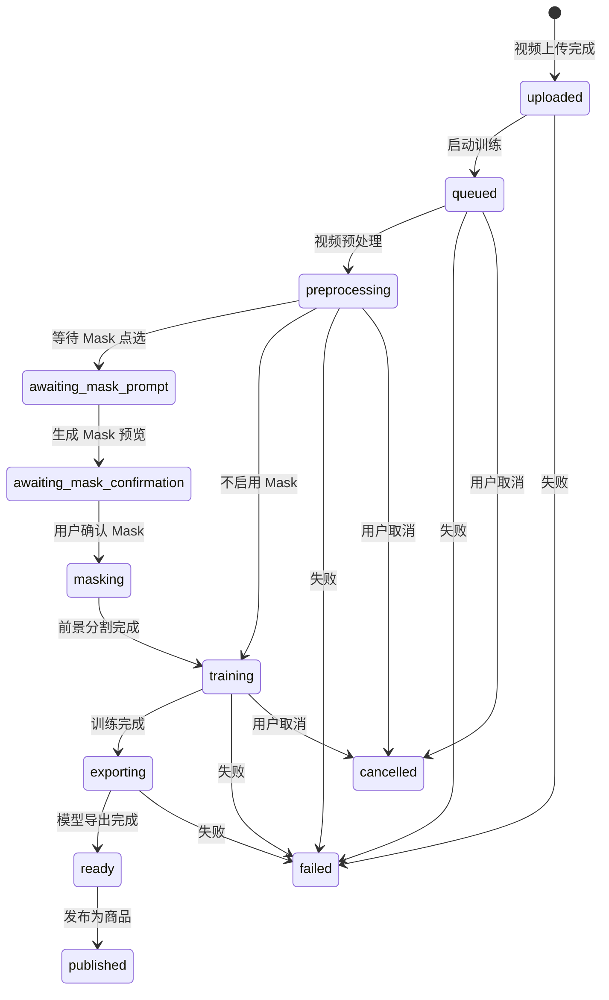
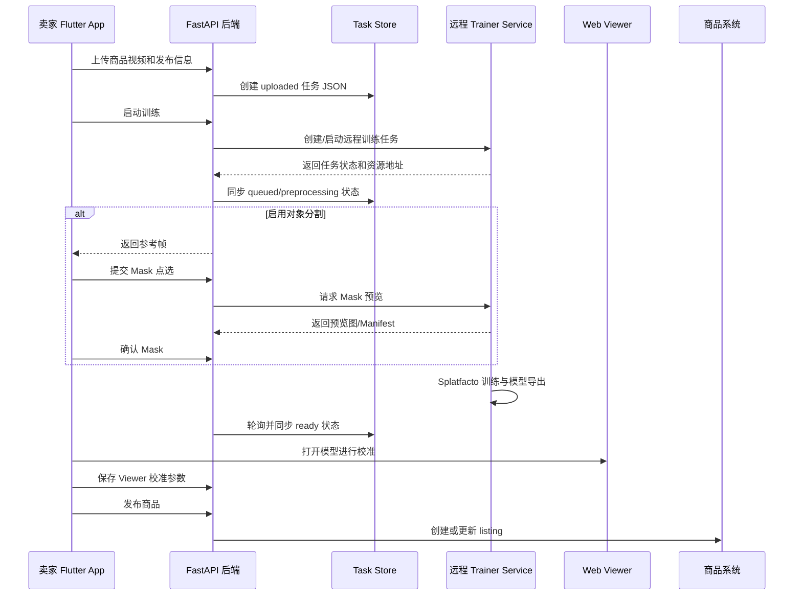
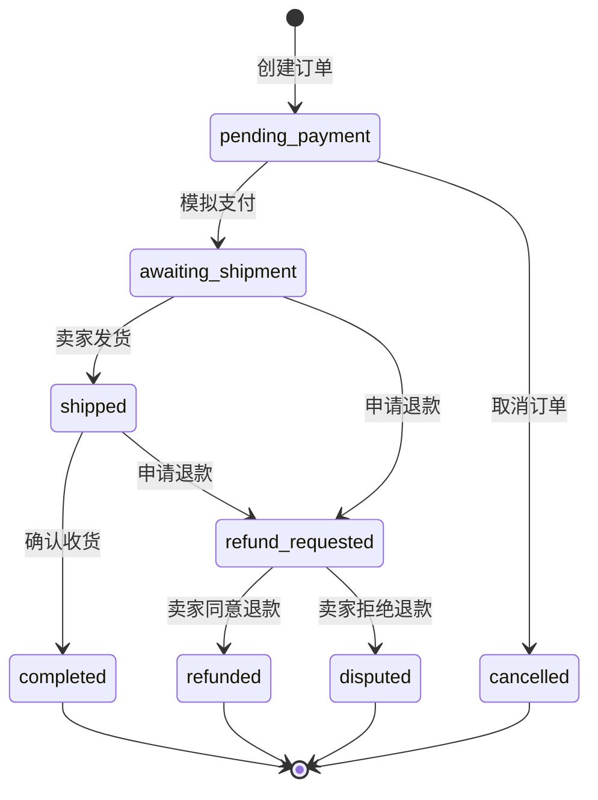

# 系统设计（二）：系统设计

## 1. 总体设计思路

转物3D 采用前后端分离的分层架构，将移动端交互、电商业务、三维重建计算、三维模型展示和数据存储拆分为相对独立的组件。这样设计的原因在于：3DGS 训练属于计算密集型任务，依赖 GPU、CUDA、PyTorch、Nerfstudio、COLMAP 等复杂环境，不适合与普通电商 API 服务部署在同一个轻量运行环境中；而移动端页面、订单、聊天、收藏等业务逻辑需要快速响应用户操作，必须保持稳定和轻量。

当前主工程 `3dv-junk-mart` 的定位是最终产品侧集成工程，主要负责 Flutter App、FastAPI 业务后端、电商业务闭环、Viewer 静态资源挂载，以及对远程 3DGS Trainer Service 的调用。完整训练服务参考实现位于 `3dgs-ref/trainer_service/`，主工程通过 HTTP 客户端调用该训练服务，并将训练结果同步为平台商品。

## 2. 总体架构

系统整体由五个主要部分构成：

- Flutter 移动端：负责用户界面、页面路由、表单输入、商品浏览、聊天、订单和 3DGS 发布流程。
- FastAPI 业务后端：负责认证、商品、搜索、收藏、聊天、议价、订单、退款、评价、钱包、会员、通知和重建任务集成。
- 远程 3DGS Trainer Service：运行在 GPU 服务器上，负责视频预处理、COLMAP 位姿恢复、SAM2 Mask、Nerfstudio/Splatfacto 训练和模型导出。
- Web 3D Viewer：以静态 Web 应用形式提供 3DGS 模型加载、旋转、缩放、平移、校准和展示能力。
- 存储层：使用 SQLite 保存电商业务数据，使用 JSON 文件保存重建任务状态，使用文件系统保存视频、封面、模型和中间产物。



该架构的核心特点是职责清晰：Flutter 只处理展示和交互；FastAPI 负责业务规则和资源代理；Trainer Service 只处理重建计算；Viewer 独立承担 3D 渲染；存储层按照业务数据、任务状态和二进制资源分离。

## 3. 前端架构设计

### 3.1 技术选型

移动端使用 Flutter 开发，主要面向 Android 真机运行，同时保留 Flutter 工程的跨平台能力。Flutter 的优势是 UI 开发效率高、状态与页面组织清晰，并且能够通过 `webview_flutter` 嵌入 Web 3D Viewer，从而避免在 Flutter 层直接实现复杂的 3DGS 渲染。

前端主要依赖包括：

| 技术/依赖 | 作用 |
| --- | --- |
| Flutter / Dart | 移动端 UI 与业务交互 |
| `http` | 与 FastAPI 后端进行 REST API 通信 |
| `webview_flutter` | 在 App 内嵌入 Web 3D Viewer |
| `image_picker` | 选择或拍摄图片、视频，用于商品发布和封面上传 |
| `shared_preferences` | 本地保存登录会话等轻量数据 |

### 3.2 模块组织

前端采用 feature-based 的模块化组织方式，按照业务功能拆分目录：

```text
app/lib/
├── app/                      # 应用入口与认证态路由
├── core/
│   ├── api/                  # API 客户端封装
│   └── session/              # 会话模型与本地存储
├── theme/                    # Material 主题配置
└── features/
    ├── auth/                 # 登录、注册、游客模式
    ├── home/                 # 首页
    ├── search/               # 搜索与筛选
    ├── listings/             # 商品卡片与商品详情
    ├── viewer/               # 3D Viewer WebView 页面
    ├── chat/                 # 消息列表、聊天、议价
    ├── commerce/             # 结算、订单、退款、评价、钱包、会员、通知、地址
    ├── sell/                 # 发布入口
    ├── profile/              # 个人中心与设置
    ├── reconstructions/      # 3DGS 发布流、任务状态、任务库
    └── shell/                # 底部主导航
```

底部主导航由 `app/lib/features/shell/app_shell.dart` 组织，包含首页、搜索、发布、消息、我的五个入口。各功能模块通过统一的 `ApiClient` 与后端交互，`ApiClient` 负责请求构造、Bearer Token 注入、响应解析和错误处理。

### 3.3 3D Viewer 集成方式

3D Viewer 不直接写在 Flutter 中，而是作为 `viewer/` 目录下的静态 Web 应用存在。Flutter 通过 WebView 加载 Viewer 页面，并把模型地址、校准参数和展示模式通过 URL 参数传入。这样做有三个好处：

1. 3D 渲染逻辑与移动端业务代码解耦，Viewer 可以单独迭代。
2. Web 端可以直接使用 PlayCanvas 等成熟渲染能力加载 Gaussian Splat 模型。
3. 后端可以统一代理远程模型资源，解决手机真机调试时访问远程 GPU 服务器不稳定的问题。

## 4. 后端架构设计

### 4.1 FastAPI 应用结构

后端入口为 `backend/app/main.py`，主要挂载两组业务路由：

- `backend/app/routes/marketplace.py`：电商业务 API，路由前缀为 `/api/v1`。
- `backend/app/routes/reconstructions.py`：3DGS 重建任务 API，路由前缀为 `/api/v1/reconstructions`。

此外，后端还挂载：

- `/storage`：暴露本地存储目录中的图片、视频、模型等静态资源。
- `/viewer`：暴露 Web 3D Viewer 静态页面。
- `/proxy/storage/{path}`：代理远程 Trainer Service 的模型文件，解决跨网络访问问题。
- `/health`：健康检查接口，用于本地调试和部署检查。

### 4.2 业务路由划分

电商业务路由覆盖以下领域：

| 领域 | 代表接口 | 说明 |
| --- | --- | --- |
| 认证 | `POST /api/v1/auth/register`、`POST /api/v1/auth/login`、`GET /api/v1/auth/session` | 注册、登录、会话校验 |
| 用户 | `GET /api/v1/users/me`、`PATCH /api/v1/users/me`、`POST /api/v1/users/me/avatar` | 个人资料与头像 |
| 地址 | `GET /api/v1/users/me/addresses`、`POST /api/v1/users/me/addresses` | 收货地址管理 |
| 首页 | `GET /api/v1/pages/home`、`GET /api/v1/home/feed` | 首页聚合数据和推荐流 |
| 搜索 | `GET /api/v1/pages/search`、`GET /api/v1/search/suggestions`、`GET /api/v1/search/facets` | 搜索页与筛选项 |
| 商品 | `GET /api/v1/listings`、`GET /api/v1/listings/{id}`、`POST /api/v1/listings/{id}/favorite` | 商品列表、详情、收藏 |
| 草稿 | `POST /api/v1/listings/drafts`、`PATCH /api/v1/listings/drafts/{id}`、`POST /api/v1/listings/drafts/{id}/publish` | 普通商品草稿与发布 |
| 聊天 | `POST /api/v1/conversations`、`GET /api/v1/conversations`、`POST /api/v1/conversations/{id}/messages` | 会话与消息 |
| 议价 | `POST /api/v1/conversations/{id}/offers`、`POST /api/v1/conversations/{id}/offers/{offer_id}/accept`、`POST /api/v1/conversations/{id}/offers/{offer_id}/reject` | 发起、接受、拒绝议价 |
| 订单 | `POST /api/v1/orders`、`POST /api/v1/orders/{id}/mock-pay`、`POST /api/v1/orders/{id}/ship`、`POST /api/v1/orders/{id}/confirm-receipt` | 下单、支付、发货、收货 |
| 售后 | `POST /api/v1/orders/{id}/refund-request`、`POST /api/v1/orders/{id}/approve-refund`、`POST /api/v1/orders/{id}/reject-refund`、`POST /api/v1/orders/{id}/dispute` | 退款与纠纷 |
| 评价 | `GET /api/v1/orders/{id}/review-draft`、`POST /api/v1/reviews` | 评价草稿与提交 |
| 账户服务 | `GET /api/v1/wallet`、`GET /api/v1/membership/plans`、`GET /api/v1/notifications` | 钱包、会员、通知 |

三维重建路由覆盖以下领域：

| 领域 | 代表接口 | 说明 |
| --- | --- | --- |
| 创建任务 | `POST /api/v1/reconstructions` | 上传视频并创建重建任务 |
| 封面上传 | `POST /api/v1/reconstructions/{task_id}/cover` | 上传商品封面 |
| 启动训练 | `POST /api/v1/reconstructions/{task_id}/pipeline/start` | 调用远程 Trainer Service 开始训练 |
| 取消训练 | `POST /api/v1/reconstructions/{task_id}/pipeline/cancel` | 取消训练任务 |
| Mask | `POST /api/v1/reconstructions/{task_id}/mask-prompts`、`POST /api/v1/reconstructions/{task_id}/mask-preview`、`POST /api/v1/reconstructions/{task_id}/mask-confirm` | 点选、预览、确认分割 |
| 查询任务 | `GET /api/v1/reconstructions/{task_id}`、`GET /api/v1/reconstructions` | 查询单个任务和任务列表 |
| 发布流程状态 | `PUT /api/v1/reconstructions/{task_id}/publish-flow` | 保存发布流程中的商品信息 |
| Viewer 校准 | `PUT /api/v1/reconstructions/{task_id}/viewer` | 保存旋转、平移、初始视角、动画确认状态 |
| 商品发布 | `POST /api/v1/reconstructions/{task_id}/publish` | 将重建结果发布为商品 |

### 4.3 统一响应与认证

后端接口采用统一 JSON 响应信封，典型结构为：

```json
{
  "code": 0,
  "message": "ok",
  "data": {},
  "meta": {
    "request_id": "...",
    "page": {
      "page": 1,
      "page_size": 20,
      "total": 100
    }
  },
  "errors": []
}
```

认证方式采用 Bearer Token。登录或注册成功后，服务端返回 `access_token`，客户端在后续写操作中通过 `Authorization: Bearer <token>` 携带。只读接口允许游客访问；涉及下单、发消息、发布商品、操作重建任务、处理订单等接口需要登录，并在服务端校验资源归属。

## 5. 数据存储设计

### 5.1 业务数据存储

电商业务数据使用 SQLite。为了便于课程项目快速迭代，当前数据库采用单表多类型设计，核心表为 `records`：

```text
records
├── entity_type   TEXT    # 实体类型，如 user、listing、order
├── entity_id     TEXT    # 实体唯一 ID
├── parent_id     TEXT    # 父实体 ID，用于表达从属关系
├── payload_json  TEXT    # JSON 格式业务载荷
├── created_at    TEXT    # 创建时间
└── updated_at    TEXT    # 更新时间
主键: (entity_type, entity_id)
```

该设计将用户、商品、收藏、会话、消息、议价、订单、物流、评价、钱包、会员、通知、地址等实体都统一存储为 `entity_type + entity_id + payload_json`。优点是开发速度快、新增实体无需频繁改表；缺点是复杂查询、强约束和数据治理能力弱，适合原型和演示环境。

### 5.2 任务状态存储

3DGS 重建任务状态使用 `storage/tasks/{task_id}.json` 保存。任务 JSON 中记录任务 ID、所有者、标题、价格、视频路径、质量档位、对象分割状态、模型地址、Viewer 校准状态、发布时间和错误信息等。任务文件通过跨平台文件锁读写，避免后端服务和训练进程并发写入造成状态损坏。

任务状态机如下：



### 5.3 文件系统存储

文件资源采用本地文件系统存储，默认根目录为 `storage/`。主要目录包括：

```text
storage/
├── db/                      # SQLite 数据库
├── tasks/                   # 3DGS 任务 JSON
├── uploads/                 # 用户上传视频
├── processed/               # 预处理数据、Mask 预览和中间产物
├── models/                  # PLY/SOG 模型与 viewer.json
├── listing_covers/          # 商品封面
└── seed/                    # 演示用初始资源
```

部署时可以通过 `STORAGE_ROOT` 环境变量将该目录指向服务器数据盘。Viewer 资源目录通过 `VIEWER_ROOT` 指定。

## 6. 3DGS 工作流设计

3DGS 重建工作流由业务后端编排、远程 Trainer Service 执行。完整流程如下：



工作流的核心阶段包括：

1. 视频采集：卖家围绕商品拍摄短视频。
2. 视频预处理：使用 FFmpeg/ffprobe 进行元数据校验、抽帧和分辨率处理。
3. 位姿恢复：使用 COLMAP 从视频帧恢复相机位姿，为后续训练提供 SfM 结果。
4. 前景分割：可使用 SAM2 对商品区域进行交互式 Mask，减少背景干扰。
5. 3DGS 训练：使用 Nerfstudio/Splatfacto 训练 3D Gaussian Splatting 表示。
6. 模型导出：导出 PLY，并可转换为 SOG 等更适合 Web 加载的格式。
7. Viewer 校准：保存旋转、平移、默认视角和动画确认状态。
8. 商品同步：将模型资源和商品信息发布到 marketplace listing。

## 7. 订单与交易状态设计

订单主状态覆盖二手交易从下单到售后的主要路径：



除主状态外，订单还维护支付状态、物流状态、售后状态、订单事件和钱包流水，使订单详情页能够展示更接近真实电商系统的信息。典型动作的副作用包括：

- 创建订单：商品进入交易中状态，订单状态为待支付。
- 模拟支付：买家钱包产生购买流水，卖家侧产生冻结入账流水，订单进入待发货。
- 卖家发货：创建物流记录，订单进入已发货。
- 确认收货：卖家冻结金额转为销售收入，订单完成。
- 同意退款：买家获得退款流水，卖家冻结或收入扣回，商品恢复可售。

## 8. 安全与权限设计

系统的安全设计重点放在业务权限与资源归属校验上：

- 登录态使用 Bearer Token，客户端统一在 API 请求头中携带。
- 只读接口支持游客访问，写操作要求登录。
- 商品编辑、删除、封面上传必须校验当前用户是否为商品卖家。
- 聊天会话消息、议价处理必须校验当前用户是否为会话成员。
- 订单发货只能由卖家执行，确认收货和申请退款只能由买家执行。
- 重建任务查询、启动、Mask、校准、发布必须校验任务所有者。
- 后端代理远程资源时对路径进行规范化处理，避免直接暴露远程训练服务内部路径。

当前课程项目中密码以哈希形式保存，模拟交易不接入真实支付，因此资金安全风险主要体现在状态一致性和权限控制，而非真实资金通道。

## 9. 部署设计

本地开发通常启动两个部分：

```powershell
cd D:\Projects\3dv-junk-mart
.\backend\.venv\Scripts\python.exe -m uvicorn backend.app.main:app --host 0.0.0.0 --port 8000 --reload
```

```powershell
cd D:\Projects\3dv-junk-mart\app
flutter run --dart-define=API_BASE_URL=http://127.0.0.1:8000
```

Android 真机调试时，需要使用：

```powershell
adb reverse tcp:8000 tcp:8000
```

服务器部署模板位于 `deploy/` 目录，包括：

- `deploy/linux/systemd/3dgs-backend.service`
- `deploy/linux/systemd/3dgs-trainer.service`
- `deploy/linux/nginx/3dgs-marketplace.conf`
- `deploy/linux/logrotate/3dgs-marketplace`
- `deploy/scripts/backup_runtime_state.py`
- `deploy/scripts/check_runtime_health.py`

部署环境中，FastAPI 后端负责对外提供业务 API、静态资源和 Viewer；远程 3DGS Trainer Service 部署在具备 NVIDIA GPU 和 CUDA 环境的服务器上；Nginx 可用于反向代理、上传大小限制、静态资源缓存和 HTTPS 入口。

## 10. 关键设计决策

| 决策点 | 当前方案 | 原因 |
| --- | --- | --- |
| 前端框架 | Flutter | 适合快速构建移动端原型，并能通过 WebView 嵌入独立 3D Viewer |
| 后端框架 | FastAPI | Python 生态友好，便于与 3DGS 工具链集成，API 开发效率高 |
| 3D 渲染 | 独立 Web Viewer | 将复杂 3D 渲染从 Flutter 中剥离，便于复用 Web 生态 |
| 训练服务 | 远程 GPU Trainer Service | 3DGS 训练依赖 GPU 和复杂环境，独立部署更稳定 |
| 业务数据库 | SQLite 单表多类型 | 适合课程项目、单机部署和快速迭代 |
| 任务状态 | JSON 文件 + 文件锁 | 训练进程和业务后端可共同读写，便于调试和回溯 |
| 模型访问 | 后端 `/proxy/storage/*` 代理 | 解决真机调试和校园网环境下的远程资源访问问题 |
| 支付实现 | 模拟支付 | 聚焦业务流程验证，不引入真实支付合规和资金风险 |

## 11. 可扩展方向

如果项目继续向生产级平台演进，可以在当前设计基础上扩展：

- 将 SQLite 单表存储迁移到 PostgreSQL 或 MySQL，并拆分标准关系表。
- 将本地文件系统迁移到对象存储，支持 CDN 加速模型和图片访问。
- 引入 Redis、Celery/RQ 或消息队列管理异步训练任务。
- 增加真实支付、退款、退货物流、售后举证和平台仲裁后台。
- 增加模型质量评估、训练失败自动诊断、移动端模型加载性能监控。
- 增加管理员后台，用于商品审核、用户管理、订单仲裁和训练任务监控。
